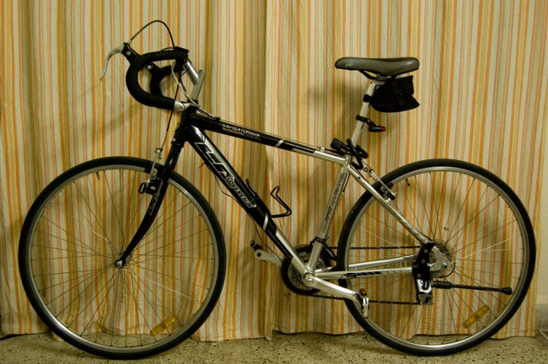
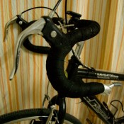
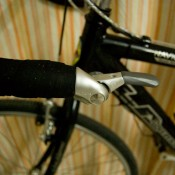
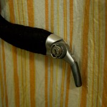
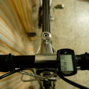

Post-conversion look of the bike

It is no secret that I am a big fan of the Navigator bicycle. Although it is not a top of the line product, it hits a sweet spot between features, comfort and affordability. There are times when I crib about the less than stellar performance of many of its components. But that cribs quickly die down after I consider that better performance would involve unpleasant tasks like spending money.

Cheap-ass local brake levers

At the time of purchase I had also hoped it would be less of an attention getter than a Trek or Merida. But I can safely say that is misguided hope because the Navigator is definitely a class better in design, style and finish than other Indian brands and easily sticks out in a crowd. But I still do leave it unattended in public areas at times with just a cable lock to hold it down and thankfully, have always returned to find it as I had left it. I am pretty certain that a Bianchi Aeron or a Merida Crossway left like that on the busy streets of Sadashiv Peth would disappear faster than bank executives after a bailout.

Ultegra front shifters (friction-only)

### Big Man on a Little Bike and Other Justifications

It took some time for my interest to deepen in bicycling enough to consider things like fitting. But a chat with Rajesh Nair after a ride around Pune found me fumbling with body measurements and running the numbers through an online fit calculator. A few minutes later, the bearded old man working at the Competitive Cyclist announced his verdict. The Navigator was at least 2 centimetres smaller than what would be an ideal size for me.

Ultegra rear shifters (can be run indexed or in friction mode)

This explained all the shoulder pain that I had been experiencing after long or fast-paced rides. The upright posture was also inefficient due to increased resistance in windy conditions, and although I was not very certain at that time, there was a gut feeling that the stooped posture on drops would increase pedalling power.

Unlike popular misconception, riding in the drops does not give a person a bad back. On the contrary, riding upright is the problem, as described by Sheldon Brown (all hail!).

> When riding a bicycle, the back should be arched, like a bridge, not drooping forward between the hips and the shoulders. If the back is properly arched, bumps will cause it to flex slightly in the direction of a bit more arch; this is harmless. If you ride swaybacked, bumps will cause the back to bow even farther in the forward direction, which can lead to severe lumbar pain. Some back-pain sufferers modify their bicycles with extra-high handlebars so that they can sit bolt upright, with their spines straight. This is actually counterproductive in most cases, because a straight spine has no way to "give" when the bike hits bumps. Road irregularities will jam the vertebrae together, often aggravating existing back problems. The bolt-upright posture is comfortable if you're sitting stationary on the bike, but is not suitable for riding much faster than a brisk walk. Riders who for some reason require such a position should use some form of suspension...a sprung saddle at the very least.

Lastly, I was missing the bar-ends on my previous bicycle and the multiple grips they offered. They made for more comfortable hands and wrists and were an absolute boon on long rides. It would be nice to have the ability to change grips again after the modification.

### Beware! There be Dragons in here.

It actually makes little sense to put a bike through extensive modifications like changing handlebars. It is expensive, time consuming and opens a wide window of opportunity for unscrupulous dealers to rip you off. If you have a choice between modding an existing bike and buying a new one, it makes more fiscal sense to make a new purchase. But if you are cramped for options or just plain sadistic, let us delve further into the pitfalls.

Purchasing spares in retail is very expensive. And most of the awesome gizmos are not available at local dealers. Which means you will be begging your Ramesh Uncle from Atlanta to bring your bar-end shifters when he returns for his annual homecoming and pray he gets the model numbers right, or else order online and get doorstep delivery.

Each strategy has its pros and cons. Ramesh Uncle might gift your “cycling kit” to you for free, but you have to risk receiving MTB grips instead of shifters because he would not know a shifter if it came and bit his ass. You won’t face that problem with an online purchase, but the associated cost of delivery is going to send the effective cost into the stratosphere, maybe even more than what you paid for the entire bike when you bought it new.

Finally, if the store owner you approach for this modification does not have a conscience, he will gladly lighten your wallet by overcharging you for spares and labour or giving your spurious spares, so your “Shimano” brake levers will last all of 2 weeks or until the first time you press them real hard in an emergency, more in line with typical Chinese-made “Shivamo” products.

So, work hard at learning the mechanics, brand names, model numbers, prices and warranty before even approaching a dealer. Then, when he spouts some bullshit about thumb shifters costing Rs. 1000 apiece, you can call it.

Cateye Strada cycle-computer (recommended!)

You must study, study and study some more, followed by a written examination and a trial by fire before getting into any such stuff. If you are fortunate enough to have access to more established high-end cycling communities and dealers then you can be exempted from the examination and trial by fire because chances are the service technicians know what they are doing. But since their counterparts in India often believe that the hammer is the solution to all derailleur alignment problems, you need to make up for their knowledge gaps. It helps to be physically present at the store to keep an eye on what shenanigans the bike store employees are up to with your mobile, to lend a hand for some of the simpler tasks and maybe picking up a few pointers along the way.

### Making Change Happen

Over several months of reading about a handlebar conversion, the one sentiment that echoed repeatedly was that aero brake levers would not work well with the direct pull brakes on my bike. I kept that information at the back of my mind though, because the dealers I met to consult and cost-compare all assured me that they would make the twain work together like old friends. For what it's worth, I'm still riding that way and happen to find no serious problems so far. But don't take my word for it.

I handed the bike over to the care of the mechanics at Surendar Cycles, hoping to pick it up a few days later. There was a bit of a let-down because they were not able to deliver on time because spares could not be sourced easily. The handlebar and bar tape were purchased from Firefox Bikes. I settled for cheap, aero brake levers. And for shifters, I initially had to go with locally made Starlit thumb shifters. These would have been fine, except that they took up prime real estate on the top of the bar, leaving little room for the computer.

I chose the Firefox alloy handlebar over a locally made steel bar to trim weight. It works and there are options in the market at both ends of this one. Cheaper steel bars can do if you are in a pinch, or if you have money to spare, more high end ergo-bars can make for a more comfortable ride. Take your pick.

We also ordered Firefox bar-tape, but it ripped to shreds within the first 2 weeks. I could have easily avoided this expensive mistake by reading some reviews online beforehand. But you can learn from my experience and need not make the same mistake.

Finally, for some unexplained reason, the service folks installed 6-indexed rear shifters for both front and rear derailleurs. As a result, the shifter connected to the front would be highly tensed at the highest setting. A normal rear shifter expects no pull from the cables at its highest setting because they are at their slackest at that point. Because the conditions were now reversed (highest setting, maximum cable pull), the slightest bump or turning the handlebar too much would cause the cable to pull hard on the shifter mechanism and make it jump to a lower setting. This was not an ideal situation to be in and downright dangerous when cornering at high speed on tight turns.

The alternative was to purchase a good set of quality shifters myself. I could not wait for or trust anyone returning from abroad to get the correct shifters for me. I also had a strong dislike for thumb shifters now because they just did not complement the drop bars. After a lot of soul searching, seeking advice on forums and intense meditation on my bank account and the potential impact on my pension portfolio over the next 40 years, I decided to spring for entry level Shimano Ultegra 64 8-speed bar-end shifters.

Evans Cycles has the best deals for these shifters. At £52, and Evans free shipping policy for goods over £50, these were affordable. I threw in Cinelli bar tape for £8 to replace the already worn out Firefox tape and condemned my frugal self to eternal guilt of extravagance.

### Real Men Don’t Index

The shifters were delivered exactly a week later. Instead of taking them to Surendar Cycles though, I rode out to Rider Owned Bicycles at Koregaon Park. I had been hearing about them for very long and wanted to try out their service and expertise for a simple project like this one.

The bar-end shifters are special in that they only support friction mode for the front shifter and either indexed or friction shifting for the rear shifter. After a few mismatched shifts in indexed mode, probably because I am still stuck with a 7-speed Tourney cassette, I switched over entirely to friction mode. It seems a bit daunting before you actually try it. But friction mode is really not very different from indexed shifting when performance isn’t high on the priorities. I don’t think I will regret this decision.

### Final Thoughts

The conversion has been one of the best decisions I made since purchasing the Navigator. The shifters do hike up the purchase price of the bike quite a bit. But the cost is more than repaid with the comfort, looks and performance post conversion. My lower-back and shoulders hurt no more even after a longish ride. I can attribute the first to drooped posture and the second to the increased reach facilitated by the drop bars. I have been taking it out for spins for a month now and hope to send it through a more thorough grind in the next several days.

The shifters did increase the cost of the bike substantially. Looking harder would have uncovered cheaper shifters such as old Suntour's. But considering that I was mid-way through a conversion, with my bike completely unusable because of the unreliable performance of the Starlit shifters (due blame on the mechanics for this boo-boo too), I had to rush through the best available option. Bringing all spares together beforehand will ensure a smoother conversion for you.

If LA Sovereign or an add-on provider sold off-the-shelf conversion kits, this task would be much easier. It could probably consist of the drop bar, shifters, brake levers, centre-pull brakes, accessories to go along with these components (cables, hooks, screws, etc.), all priced reasonably. I see no problem in this approach, because with the mudguards and rear-rack that the Navigator comes with, it effectively would convert it into a low-end touring bike. The only other road bike that LA Sovereign has in its line-up is the Urbano, which is more than twice the cost of this bike. But with no facility for mudguards and a rear rack on it, there is hardly any chance of overlapping user requirements. LA Sovereign can continue to target performance bikers with the Urbano while catering to the needs of commuters and tourers with the Navigator and an optional conversion kit.
