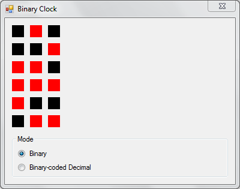
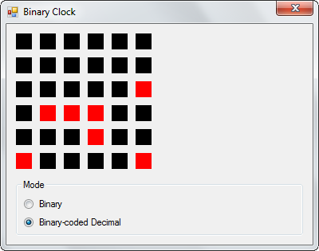

Bit manipulations are second nature to electronics engineers, embedded programmers and a swathe of engineers who work with low-level systems software such as operating systems, languages and critical frameworks. While it does seem daunting at first, the fundamentals are very simple as explained in my previous post. This post builds upon those concepts to implement a simple binary clock using C#.

The core of the clock is in the BinaryClock class that inherits PictureBox, since this is primarily a visual control and needs a visual context to display its output. Inheriting from PictureBox also makes it easy to use as a drag-and-drop control in the Visual Studio IDE.

BinaryClock consolidates the timekeeping and drawing capabilities into a single class (the OO design crowd may cringe now). An instance of the Timer class ticks every second to invalidate the display and trigger a refresh. The mode field determines the method used to display the clock face - pure binary or binary-coded decimals. Its value can be set from one of the values in the imaginatively-named enum in the same class called Modes.

This brings us to the paint method which is triggered whenever the control has to be redrawn.

```csharp
void Paint(object sender, PaintEventArgs e)
{
    DateTime dt;
    int h;
    int m;
    int s;
    Rectangle area;
    int offsetX;
    int offsetY;

    dt = DateTime.Now;
    h = dt.Hour;
    m = dt.Minute;
    s = dt.Second;

    area = new Rectangle(0, this.Height - BinaryClock.RECT_SIZE, BinaryClock.RECT_SIZE, BinaryClock.RECT_SIZE);
    offsetX = this._columns * (BinaryClock.RECT_SIZE + BinaryClock.RECT_OFFSET);
    offsetY = BinaryClock.COL_OFFSET;

    // Get bits for the hours component
    this._draw(h, e.Graphics, ref area);
    area.Offset(offsetX, offsetY);

    // Get bits for the minutes component
    this._draw(m, e.Graphics, ref area);
    area.Offset(offsetX, offsetY);

    // Get bits for the seconds component
    this._draw(s, e.Graphics, ref area);
}
```

This method begins by fetching the current time and extracting its components. Offset values required for the drawing are also initialized depending upon the current display mode. It then makes three calls to the drawing method to draw the appropriate graphics for the hour, minute and second values. Two draw methods are implemented in this class - drawBinary and drawBCD. Both take three parameters - the value to be represented, the Graphics object, and initial position.

### Binary Drawing

The drawBinary method draws 6 boxes, vertically stacked, in a single column to represent the value in pure binary.


The application running in pure binary mode

```csharp
for (i = 0; i < 6; i++)
{
    bit = value & (1 << i);

    if (0 == bit)
        g.FillRectangle(_offBrush, area);
    else
        g.FillRectangle(_onBrush, area);

    area.Offset(0, - (BinaryClock.RECT_SIZE + BinaryClock.RECT_OFFSET));
}
```

The value of each bit in a single number is extracted through the following snippet.

```csharp
bit = value & (1 << i);
```

This is an application of testing if the n-th bit is set in a number. The digit 1 (0b00000001) is left-shifted to the position at which the bit in the value is to be inspected, then ANDed with the value.

```
0b00001010 & 0b00000001 = 0b00000000
0b00001010 & 0b00000010 = 0b00000010
0b00001010 & 0b00000100 = 0b00000000
0b00001010 & 0b00001000 = 0b00001000
```

The bit has been set if the result is greater than 0.

This is applied in a continuous loop through all the bits in the number. The colour of the box is determined by the value of the bit in that position. Zero is filled with the off colour, and any other value is filled with the on colour.

### Binary-coded Decimal

The second function - drawBCD - has the same signature as drawBinary. The only difference is in the way it represents the number on the canvas. Instead of drawing the component value in a single column, it splits it into two decimal digits and draws each digit in its own column. The individual digits are extracted by dividing and modding with 10, then calling the drawBinary function for each digit.


The application running in BCD mode

The Visual Studio solution for this project can be [downloaded from here as a ZIP archive](binaryclock.zip).
