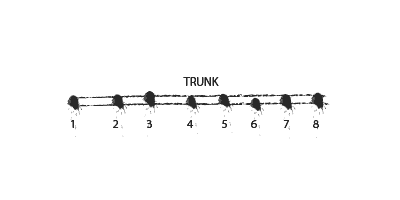
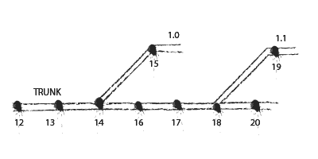
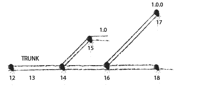

We have come a long way since 2008 when I wrote [this introductory article about version control systems](/a-gentle-introduction-to-version-control-part-i/ "A Gentle Introduction to Version Control – Part I"). Their rising popularity in the past few years is a notable sign of maturity in the software development community. Whereas they were once a bastion of only "serious" development operations, now even app developers working alone use them regularly.

In this article, I talk about how a team can use a version control system to its advantage by describing a preferred way to store the files in the repository and some processes to complement the structure.

There are myriad ways of organizing a version control repository. It is a sophisticated file system, after all. A well-structured repository can be a valuable asset to a software team by creating a clearly defined workspaces for programmers, opening up the opportunity to create a continuous integration pipeline, and standardizing deployment.

### Repository Layout

In my preferred layout, **the trunk is used for the main development line**. In addition, **branches are created for releases** and feature sandboxes. This style of organization is loosely based on trunk-based development.

#### The Trunk

All the primary development of the project occurs in this directory. The trunk is further organized into sub-directories for every project that constitutes the final product. For example, a product might consist of separate web and desktop components. Or it might have a dependency on a separate static or dynamic library. The exact arrangement of this is determined by the programmers and release engineers working together. All these projects reside side-by-side in the trunk.

A feature or bug fix is considered open until the code has not been committed to the trunk. Hence, all developers have access to this directory and must **make it a regular part of their daily work**.

#### Maintenance Branches

Once the product reaches a milestone and is deemed ready for release, the release engineer is responsible for generating a binary and deploying the product. But the first step is to **make a maintenance branch**. This branch is a snapshot of the trunk that can be used by developers to provide bug-fixes to an already deployed product without accidentally releasing new features.

It is named according to whatever convention the team decides (I prefer a numeric x.y scheme).

If bugs are discovered in the product post release, they are patched in the trunk and merged into the active maintenance branch. Other developers, meanwhile, can safely continue adding new features on the trunk without inadvertently bringing them into the current deployed versions.

A bug-fix release is made out of the maintenance branch after a bug is patched.

It is important that **bug fixes should originate in the trunk and later be merged into the branch** rather than the other way around. If the fix is made in the branch and the developer forgets to merge it back into the trunk, it can cause a regression later down the line. By patching in the trunk, the developer uses the process to automatically ensure that patches exist in both places.

#### Tags

Release binaries should always be made out of a clean export from the repository. But which revision should one export? If you're creating a maintenance branch, you could use its HEAD revision. But you're out of luck if you need to generate a previously released build again after subsequent edits have been made to the branch. Unless you tagged the branch before generating a binary.

**A tag is a branch that everyone agrees to never edit**. It is given a unique name from the rest of its siblings. My preference is to go the x.y.z scheme, where the x and y components of the name come from the maintenance branch from which it derives its lineage.

The z component of the tag name is set to 0 when the first maintenance branch is made. This number is incremented whenever subsequent tags are made out of the maintenance branch.

### Using the Repository

Once the structure is ready, some processes need to be put in place in order to utilize it. The typical developer role has it easy - keep committing error-free code into the trunk, and make sure the working directory is updated from the trunk as often as possible.

#### Feature Releases

A new feature release begins when one of the managers green-lights it. The repository is locked down temporarily and **a maintenance branch and a tag are created from the head revision of the trunk**. These two copies are named according to the version convention in place for the project.

This maintenance branch supersedes all previously generated branches, which may even be deleted from the repository. The repository is then unlocked and developers can go back to making commits in the trunk.

#### Maintenance

When bugs are discovered in a released product, the developers investigate in the trunk and attempt to fix it there. If found and fixed, they notify the release engineer who then cherry-picks the relevant commits and **merges them into the current maintenance branch**.

**The maintenance branch is tagged** after it is deemed ready for release. The binary generation and deployment process remains the same - clean export from the newly created tag, followed by compilation and deployment.

If a bug cannot be located in the trunk, the developer may have to look for it in the maintenance branch and fix it if it is found there. In this case, the bug fix may be merged back into the trunk if deemed necessary.

#### Release Generation

The release engineer's work is not done yet. The release binaries are yet to be created from the newly created tag. For this, the tag is exported from the repository into an empty directory. This is important so that no unnecessary files are accidentally added into the binaries. This step cannot be emphasized enough.

*All binaries must be generated from a clean and complete export from the repository.*

Generating binaries from partially exported directories runs a high risk of including incorrect or outdated files into the binary. This inaccuracy can be the source of impossible-to-reproduce bugs or regressions. At the minimum, it is a sign of a poorly managed process.

Once the binary is generated, it is packaged to its final consumption form - an archive or installer for distribution - then deployed to wherever it is needed (such as a file server or web server).

The binaries and installers may be added into the repository for posterity.
