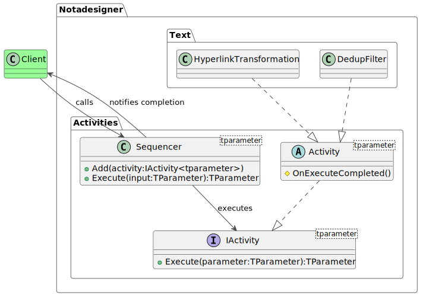

Many features like automatic memory management have made modern programming technically easier. But pesky business requirements still remain a formidable challenge. A large portion of the complexity in modern applications originates from ever-evolving business rules. In an ideal scenario, there would be no functional requirements and programmers would be paid directly in Cheetos and Mountain Dew for doing cool stuff all day. Unfortunately, that's not the case, and all payments must be made in fiat currency rather than snacks. So a business is necessary in order to generate revenue. And with it come its own requirements for things like processes, regulations and laws.

In spite of this, a smart programmer can notice that the application of rules to a process is easily separated from the rules themselves. They can be applied in linear sequence or driven by outcomes of its component steps (such as offering the customer a choice between cash discounts or adding complimentary products instead). Linear processing is straightforward to implement – execute each step in a queue one at a time until they are all done. Conditional processing depends on the outcome of the previous step, making the workflow a gigantic mishmash of if-else statements if not handled carefully from the start.

Both types of processing can incorporate structures such as loops, sub-routines and interrupts.

This post demonstrates an implementation of a sequential workflow where the process pipeline is separated from the steps in the process. This architecture allows for the execution of the pipeline to remain unchanged even if the steps in the process change.

The workflow model constitutes of the entities described below.



Activities are the steps which must be performed in a workflow. The type **IActivity<TParameter>** defines the common minimum standard that all activities must implement. It requires a method called Execute which takes one parameter.

```csharp
void Execute(TParameter parameter)
```

The parameter is the input that this activity may require. Its type should match the type specified in the concrete constructor of this interface. Consuming the Sequence class is easy if this is a reference type. The client simply has to call its Execute method and wait for it to return. The modifications will show up in the input instance that the client already has. But if it is a value type, the the caller has to subscribe for the ExecuteCompleted event from the Sequence, whose handler receives the modified value as a parameter.

The IActivity<TParameter> type exposes an ExecuteCompleted event. The Sequencer must subscribe to this event in order to be notified when the activity completes its execution successfully. The event delegate receives a parameter of type ExecuteCompletedEventArgs. The Result property of this instance contains the modified value of the input.

**Activity<TParameter>** is an abstract class that provides a minimal implementation of the IActivity interface. Derived classes which override the Execute method must ensure that the method in the base class is called, or otherwise ensure that the OnExecuteCompleted method is called when the method completes successfully.

**Sequence<TParameter>** is the primary execution path of the workflow. It lets the client add activities to the workflow and execute them in the order that they were added.

The Sequence class stores the activity class instances in a queue. It uses an enumerator to ratchet through the list. The enumerator points to the first activity instance and executes it. The Sequence class subscribes to the ExecuteCompleted event from the Activity instance, which causes the enumerator to move to the next activity in the list and execute it. This process continues until all the activities in the list have been executed. At this point, the Sequence itself dispatches the ExecuteCompleted event, which the client must subscribe to.

The Sequence class exposes the following methods.

```csharp
void Add(IActivity<TParameter> activity)
```

This method accepts an IActivity instance, whose generic parameter must match the generic type of the Sequence class instance itself.

```csharp
public void Execute(TParameter input)
```

This method triggers the execution of the Sequence. It takes a single parameter of the type declared in TParameter. This input is passed as a parameter to the Execute method of all the Activity instances in the sequence.

Activities are further classified into filters and transformations. A filter scans the input and either allows or disallows further processing. It does not modify the input in any manner. A transformation activity modifies the input in some way and returns the modified value as output. In the case of the former, there needs to be a mechanism to signal a break in the process to the client. For this, the activity must throw a **ExecuteException**. The client of the Sequence class must wrap the call to the Execute method in a try block and handle any failure to complete the process in the catch block.

These types are collectively sufficient to provide the framework for any simple linear workflow. However, the actual steps to be performed are not part of the framework. The client must provide the concrete implementations of the Activity class, one for each step in the process. These classes are instantiated and added to the Sequence class.

### Examples

The following section demonstrates how a transformation and a filter can be implemented and consumed by this framework.

Classes which derive from Activity are part of the client implementation and must be stored in the client namespace. In this example we use the Notadesigner.Text namespace to implement a HyperlinkTransformation and a DeDupFilter.

**HyperlinkTransformation** scans the input string for any sequences that begin with http:// or https:// and wraps it within an anchor tag. This example uses a very simple RegEx sequence to perform this step. We are not really interested in the versatility of the regex for this throwaway example.

```csharp
public class HyperlinkTransformation : Activity<string>
{
    void Execute(string input)
    {
        RegEx.Replace(input, @"http(s)?://[a-z.]+");
        base.Execute(input);
    }
}

...
var activity = new HyperlinkTransformation();
activity.ExecuteCompleted += (sender, e)
{
    Console.WriteLine{"Result {0}", e.Result);
};
activity.Execute("Visit http://www.notadesigner.com for best deals in programming snippets.");
...
```

When the Execute method completes, it dispatches the ExecuteCompleted event.

**DeDupFilter** compares the string with existing values in the database. If it is a duplicate, then the previous string is maintained as is and the new one is discarded. This is achieved by throwing a SequenceException from the Execute method of this class if an existing match is found.

```csharp
public class DeDupFilter : Activity<string>
{
    void Execute(string input)
    {
        // CurrentEntries is of type List<string> and is populated previously with string entries
        if (CurrentEntries.IndexOf(input) > -1)
        {
            throw new ExecuteException("Entry already exists");
        }
    }
}

...
try
{
    var activity = new DeDupFilter();
    activity.Execute("Talk is cheap. Show me the code.");
}
catch (SequenceException)
{
    Trace.TraceError("Entry already exists");
}
...
```

The client can then handle the exception and proceed with the understanding the input being inserted was already present in the database.
