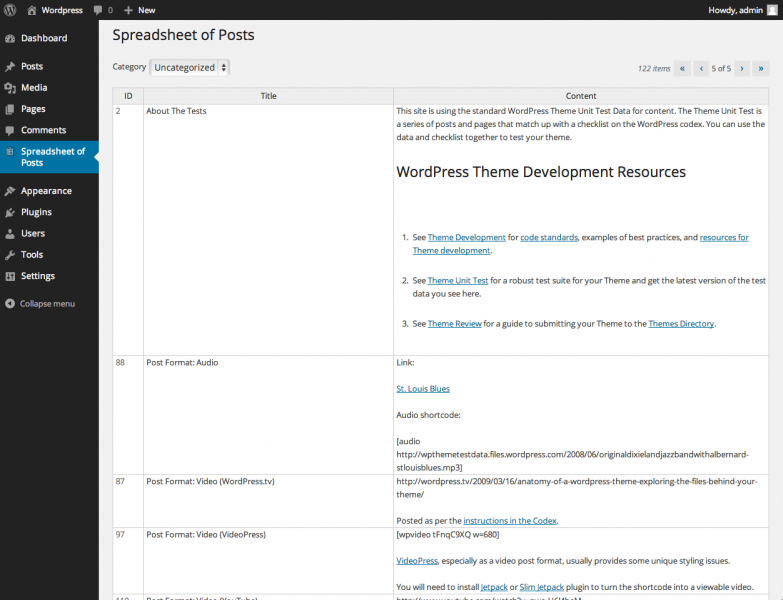

When Microsoft was working on Excel during the early nineteen nineties, their research indicated that many people did not use spreadsheets for the mathematical tasks (such as financial planning, bookkeeping or simulations) which were the original goals of the spreadsheet genre. Instead, they were used for making lists - grocery shopping, planning parties for their kids, logging project tasks, so on. Microsoft took this research into account and reoriented the functional specifications to make list-making much easier than the competition and previous versions of their own product. Joel Spolsky, who was program manager for Microsoft Excel during this period, states the following.

> When we were designing Excel 5.0, the first major release to use serious activity-based planning, we only had to watch about five customers using the product before we realized that an enormous number of people just use Excel to keep lists. They are not entering any formulas or doing any calculation at all! We hadn't even considered this before. Keeping lists turned out to be far more popular than any other activity with Excel. And this led us to invent a whole slew of features that make it easier to keep lists: easier sorting, automatic data entry, the AutoFilter feature which helps you see a slice of your list, and multi-user features which let several people work on the same list at the same time while Excel automatically reconciles everything.

[The Process of Designing a Product](http://www.joelonsoftware.com/uibook/chapters/fog0000000065.html), Joel on Software

If you abstract away the specifics of the application, you can easily see that the spreadsheet grid is a one-table database. Having multiple tables can be much more efficient, but a single table is easier to understand for people who do not use databases regularly.

The simplicity of spreadsheets as databases goes beyond just reading.

Adding columns? A database engine needs, at the least, the column name and its data type. In a spreadsheet all you need to do is place the cursor over the first empty cell in the first row and type its name. Filtering is one of the simpler tasks in a database, but spreadsheets even make that easier by providing a dropdown of valid values to choose from. Even inserting new records is much easier in a spreadsheet as compared to a database engine. And more importantly, the grid is a good way of capturing an aggregate view of the entire database and making wholesale changes to groups of records quickly.

A spreadsheet application can be the subject of some really grimy IT horror stories that can involve file shares, multiple users and overwritten records. But if put into a proper data validation framework, the spreadsheet interface is robust and easy to use. Many database management clients use the it to represent their table interface, even for multiple relationships.

Extending to multiple dimensions comes at the cost of some loss of elegance when representing one-to-many relationships. While this UI works, it likely marks the limits of a spreadsheet interface. Nested relationships quickly become difficult to understand. And each nested level can represent only one relationship. It comes as no surprise then that so many database-oriented applications (not the management clients themselves) eschew the spreadsheet interface in favour of a form-driven approach.

But I still think that the spreadsheet interface is vastly underused on the web. As I have mentioned above, it does work for simpler collections of records, such as articles in a content management system or user lists.

Spreadsheet of Posts is a WordPress plugin that aggregates all posts into a spreadsheet interface. While WordPress is a fairly simple to use product for even laypersons, the Post creation process leaves a bit to be desired. The sheer amount of shuffling back and forth between the All Posts and the Edit Posts screen takes away a lot of time. This is similar to the REP loop that interpreted languages provide. The visual difference between two screens is bad enough. To that, the delay caused by network activity, fetching the same data repeatedly from the database, regenerating almost identical markup each time and then rendering it again on the client side increases the effort of getting into the flow. Any boredom while performing such a task is justified.

Spreadsheet of Posts attempts to address these shortcomings by putting all the posts into a grid. Edits are made in-place on the grid itself. New records are inserted by filling in a blank row. Records are deleted by selecting any cell and hitting delete. The record that corresponds to the selected row is deleted. The plugin uses standard page-based navigation to cycle through records that do not fit into a single page. It also provides an alternative to display all the records in a single page. Cell heights can be varied to fit the content, or be set to a fixed constant.

The underlying grid is the [Hands on Table](http://www.handsontable.com) jQuery grid editor. While there are more functionally complete alternatives, the interactions and appearance of Hands on Table come closest to replicating Excel. Even the bare bones demo on their home page evokes a lot of familiarity to Microsoft's product. This is a big necessity to make users more comfortable with Spreadsheet of Posts. The rest of the back end of the plugin uses the standard WordPress framework.

Spreadsheet of Posts is still work in development. [A current version can be downloaded from here](http://wordpress.org/plugins/spreadsheet-of-posts/ "Spreadsheet of Posts").
