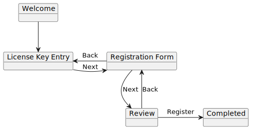

The service locator pattern is understandably looked down upon. I'm not the kind to get swept away with hubris, but injecting a service provider into other classes, and telling them to pick whatever they like out of it is just global variables with more steps.

There are certain cases where this is the most straightforward solution to a problem. But this anti-pattern can still be avoided with a bit of thought. This is a real-world scenario that I faced few months back.

### Background

A wizard is a UI pattern that is used to guide the user through the stages of a process (a license key verification and user registration in this case). I wrote a simple application that would lead the user through each step.

1. Welcome and short instruction note.
2. License Key Entry and verification.
3. Registration Form input and validation.
4. Review form input.
5. Completion.

But there may be cases when somebody might need to change their license key after it has been entered. For this, the application had a button to go back to the previous screen.



Each screen was implemented in its own class as a window object. It would be ideal if the screen object would be injected wherever needed through Microsoft Dependency Injection. The Welcome class would receive a reference to License Key Entry, which would receive a reference to the Registration Form, and so on. But some of the screens also needed a reference to the previous screen. Registration Form would require a reference to License Key Entry. Confirmation would require a reference to the Registration Form.

This would create a circular dependency, which is not supported by Microsoft Dependency Injection.

```csharp
public class LicenseKeyEntry : Form
{
    public LicenseKeyEntry(RegistrationForm next) { ... }
}
```

```csharp
public class RegistrationForm : Form
{
    public RegistrationForm(LicenseKeyEntry previous, Confirmation next) { ... }
}
```

```csharp
private static void ConfigureHostServices(HostBuilderContext _, IServiceCollection services)
{
    ...
    services.AddSingleton<LicenseKeyEntry>();
    services.AddSingleton<RegistrationForm>(); /// Welp! Circular dependency!
    ...
}
```

```
System.InvalidOperationException: A circular dependency was detected for the service of type 'LicenseKeyEntry'.
```

My first instinct was that this was an impossible problem to solve. Classes need references. References must come from the DI container. The container won't allow creating circular dependencies between types. Just hand over a reference to the service provider to the objects, and let them ask for whatever objects they need at runtime.

```csharp
public class RegistrationForm : Form
{
    private IServiceProvider _services;

    /// Don't do this!
    public RegistrationForm(IServiceProvider services)
    {
        _services = services;
    }

    public void Next()
    {
        var next = services.GetRequiredService<Confirmation>();
        ...
    }

    public void Previous()
    {
        var previous = services.GetRequiredService<LicenseKeyEntry>();
        ...
    }
}
```

But this reeks of a code smell. The class was now bound to the types in the specific dependency injection framework. Switching over to another framework or removing it altogether would be difficult. Testing and mocking became more complicated, because the unit tests would now have to inject DI container, which would contain the mock types.

### A Workaround

While the approach shown above is not advisable, it does demonstrate the strategy of using lazy resolution to break circular dependencies. .NET contains a built-in `Lazy<T>` type that can be leveraged for the job.

Begin by changing the constructor signatures to use `Lazy<T>`, where `T` is the actual type that is required.

```csharp
public RegistrationForm(Lazy<LicenseKeyEntry> previous, Lazy<Confirmation> next) { ... }
```

Then, inject the Lazy types into the service container.

```csharp
services.AddSingleton<LicenseKeyEntry>();
services.AddSingleton<RegistrationForm>();
services.AddSingleton<Confirmation>();
services.AddTransient<Lazy<RegistrationForm>>();
services.AddTransient<Lazy<LicenseKeyEntry>>();
services.AddTransient<Lazy<Confirmation>>();
```

This removes the circular dependency because these types don't have a direct reference to each other. But it's important that the value of the dependent types is not realised in the constructor. They should continue to hold a reference to the `Lazy<T>` type instead, and only reify the underlying instance later down the line.

```csharp
public class RegistrationForm : Form
{
    private Lazy<LicenseKeyEntry> _previous;
    private Lazy<Confirmation> _next;

    public RegistrationForm(Lazy<LicenseKeyEntry> previous, Lazy<Confirmation> next)
    {
        _previous = previous;
        _next = next;
    }

    public void Next()
    {
        var next = _next.Value;
        ...
    }

    public void Previous()
    {
        var previous = _previous.Value;
        ...
    }
}
```

### Addendum

Thomas Levesque wrapped this into an elegant implementation that is exposed by a simple extension method on the service collection. [The full article is available on his blog.](https://thomaslevesque.com/2020/03/18/lazily-resolving-services-to-fix-circular-dependencies-in-net-core/)

```csharp
public static class ServiceCollectionExtensions
{
    public static IServiceCollection AddLazyResolution(this IServiceCollection services)
    {
        return services.AddTransient(typeof(Lazy<>), typeof(LazilyResolved<>));
    }

    private class LazilyResolved<T> : Lazy<T>
    {
        public LazilyResolved(IServiceProvider serviceProvider) : base(serviceProvider.GetRequiredService<T>)
        {
        }
    }
}
```
