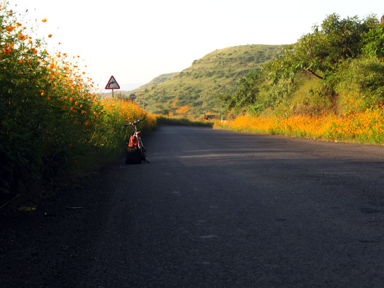
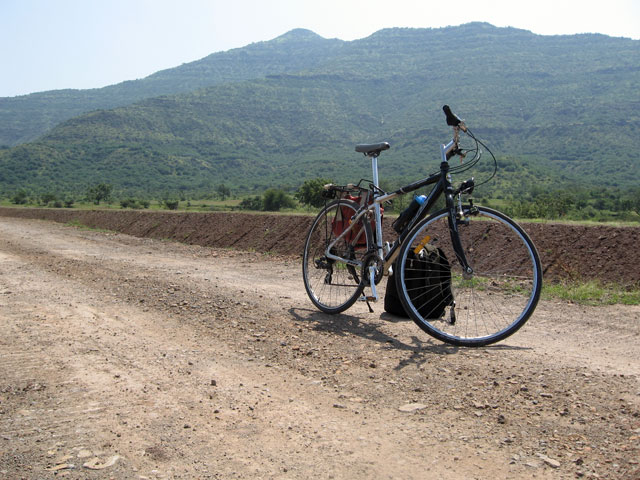
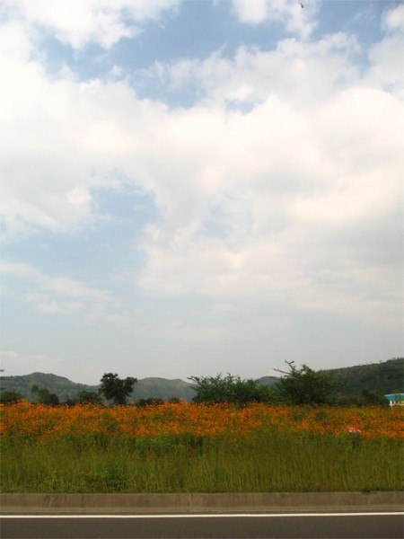

God bless America.

We have more American holidays on our company calendar than local ones, probably because most of our business comes from our fair-faced brethren, who would be working over Diwali and Gandhi Jayanti, but probably not on Christmas or in this case, Columbus Day. Since the missus caters to more local demographics and would be working, I had a day to myself to do as I pleased.

Gautam Raja had pointed out earlier that a century ride was a very American concept and hence often assumed to be in miles. This came about during conversation about my previous trip to Khandala-Pargaon when I gloated about completing a century and a half - 150 kilometers - in a single day. Missing out the century-mile accomplishment by a very narrow margin really got my goat and I decided to remedy the problem. And I decided to take off again towards Pargaon, and maybe even further towards Panchgini just to prove what a bad-ass rider I was.

### The Heart of the City

The route till Panchgini goes well over 60 miles in one direction. In an attempt to reduce the distance a bit I changed it to cut across the city and into Katraj instead of taking the longer route over the Bangalore-Bombay bypass. This was a decision that I was to regret all day.

The National Highway goes through the heart of the city from Shivajinagar, Shanivarwada Fort, Kasba Peth, Budhwar Peth, Shukrawar Peth, Swar Gate and into Katraj. The road varies from rough rubble in Budhwar Peth to concrete stretches at Katraj. I left home at 5:30 in the morning and headed off towards Ganeshkhind Road. There were shorter routes to Shivajinagar but I put safety ahead and took the longer, better lit road instead. For the first time since we moved here I saw the fountains at Bremen Chowk actually functioning and illuminated - a pleasant side effect of the ongoing Commonwealth Youth Games. The newly installed fountains at University Chowk were also running, although the cops seen the evening before were absent and traffic moved on of its own accord.

I hit the highway at Shivajinagar at about 5:45 and was surprised by the amount of traffic already on the road in spite of the early hour - mostly rickshaws ferrying travellers to various bus stands across the city.

I really cannot make up my mind about whether the games are good for the city or not.

On one hand, large portions of the city have been given a makeover to cast a good impression upon our foreign guests. For a change, signals are working and even being enforced. And the general presence of so many pretty tourists really does wonders to boost ones morale, especially when you are sporting a sleek conversation-starter bicycle.

On the other hand there is this massive wastage that seems to happen everywhere I go. The Pune Municipal Corporation apparently missed the memo about the ongoing power-crunch affecting Maharashtra. Fountains running late into the night are one thing. But having them running well into the next morning just does not make sense. Especially when you stop to consider that the signals right next to them are promptly switched off from 9 in the night till 8 the next morning. And let us not even talk about the gravy train that the road-repair contractors have been riding upon since the last year.

In the midst of these thoughts I passed the PMC Headquarters and was shocked to see the entire complex lit up with fairy lights. Great! Just great. Entire villages in the state can't have a 10 watt light bulb to light up their roads after sundown and these guys were having a party. The freshly cleaned and illuminated fountain at Shanivarwada Fort a little further down the road paled in comparison.

Most people who know me are pretty certain that there is little room in my life for religion and rituals. But there is this bit of faith deep inside me that keeps the flame burning in troubled times. And this faith drew me into a detour into Kasba Peth just outside the Ganpati mandir there. This temple was installed around 1639 by Queen Jijabai Bhosale, the mother of Shivaji and the idol is venerated as the presiding deity of the city. During the annual Ganesh festival, the Kasba Ganapati idol is the first amongst the five "Manache Ganapati" of Pune which lead the immersion procession over Laxmi Road. What makes this place special for me is its beautiful wooden construction and serene atmosphere. Stepping over the threshold of this temple is enough to transport a person back into times long gone. It is a great place to hole into while being lost in your thoughts.

This morning though I simply stopped outside the temple doors and shot up a quick prayer. And I was off again.

The rest of the ride was uneventful. Budhwar Peth and Shukrawar Peth looked completely different, devoid as they were of bustling crowds and overwhelming traffic. The sky too had begun to don its mantle of blue by now. But all was yet quiet and only few lights flickered in the closely packed buildings on either side of the narrow road. The only sound was of the chain whirring and the cable lock rattling against the rear rack. I rode on quietly.

The silence disappeared all too suddenly as I found myself surrounded by black fumes and dirty buses at Swar Gate bus stand. The smell of diesel was thick in the air and all I wanted to do was get out double-quick. The traffic too was problematic, made up as it was of errant rickshaws, 6-seaters and unmindful state transport buses. One of those behemoths could run over me in an instant and not even realize it till much later. I flipped the bird at a few drivers then quickly got out of their way.

The traffic died down just as quickly as it started though and I was back onto quiet roads. Thankfully the road widened significantly and had an improved surface. School students and newspaper delivery boys began to crisscross my path on their own bikes. Some looked at me and smiled.

"Race aahe, race!" - It is a race, I heard someone shout.

Obviously, they did not know that the Commonwealth Youth Games did not have a cycling event in their itinerary.

### Beyond Familiar Territory

The road had now begun to climb rapidly. By the time I reached Bharatiya Vidyapeeth, I was huffing away in a low 2nd gear. Banners all over the place welcomed President Pratibha Patil, who had just days ago been given a honorary Doctor of Letters degree by this university, which kind of sucks when compared to former President Kalam's degree in aeronautical engineering and 30 honorary doctorates. I love that guy. And I hate this one just as much.

I made it over the slope finally and heaved a sigh of relief. My relief was shortlived though, because the gradient quickly picked up again after the Katraj Bus Stand. To make things worse, the recent monsoons had taken a heavy toll on the road and at that point I would have gladly traded the Navigator for a bike with good shock absorbers instead. Front and rear ones, please. I crawled along uphill in single-digit speeds for about a kilometre before finally giving up and dismounting.

It was around 7 now and the sun was beginning to be seen over the tops of the mountains. There was quite a nip in the air yet, though and everything was wrapped in fog. I glanced over the edge of the road onto the valley below and saw lush green fields interspersed with patches of bright orange flowers. This called for a picture. When I removed my backpack for the camera, I noticed the vapour rising off my own perspiration-soaked back. Crazy!

I was ready to move on after some pictures. The road kept changing fast between good and mediocre and I alternated between riding and pushing. The climb continued to get more intense. Riding in low gear was affecting the stability of the bike too causing me to weave over the road in order to maintain my balance at slow speed. With all the buses and taxis passing by at high-speed, such behaviour was an invitation for trouble.

"Accident Prone Area", the sign read, followed by a steep 180 degree curve. A gaping hole in the guard wall indicated the spot where some unwary driver had ploughed his vehicle off the road into the bushes, or worse, the valley beyond. I was glad that the cycle would never be able to do such damage, but only for a second when it struck me that crossing paths with an over speeding truck probably would leave me much worse off than the wall. I shook off those thoughts from my mind and stopped to take in the breathtaking scenery and some pictures.

The apex of this climb was the Old Katraj Tunnel. I half-rode and half-pushed my way up the steep ghats for the next half hour before reaching the mouth of the tunnel. At a measly 300 metres long, it was a disappointment. The new tunnel on the Bangalore-Bombay bypass is easily a kilometre or so longer than this one. I flicked on the dynamo just to be safe, even though I could clearly see every inch of the road right up to the other end and rolled through quickly.

### Sunshine Highway

The view at the other side was completely different. The road was very well laid, and outlined clearly by the same orange flowers I had seen earlier in the valley. The sun too had come up higher since my first break on the ghats and the mist had dissipated. The orange from the backlit flowers cast a beautiful shade on the road ahead and all seemed well again.

<figure>
  
  <figcaption>Sunshine Highway; Katraj</figcaption>
</figure>

I stopped for a few pictures before moving on.

Soon the highway merged into the Bangalore-Bombay bypass. The bike finally was able to pick on some speed on the concrete and half an hour later I had brought my dismal average of 15 km/h at the mouth of the tunnel to a more respectable 19 km/h. My speed on the new road stayed in the early 30's through this time.

I halted at 8:00 sharp for breakfast and a quick call to my wife. I was not hungry really, but went ahead and ordered an idli. It was a long day ahead and I would need all the energy I could get. After refilling my water bottles, I hit the road again.

Before leaving, I flicked on the radio and plugged it into one ear. This was to be my companion the rest of the day.

I covered several kilometres over the next hour before the next water-break. It was beginning to get warm now and staying hydrated became a priority.

### Whoops!

*Sab Sud-Budh-Hosh Gavaa Ke,* *Deewani, Main Paagal, Main Jhalli Ho Gayi.* *Main Talli, Main Talli, Main Talli Ho Gayi*

Hard Kaur screeched out of the earphones just as I noticed by bicycle act
up.

I noticed a distinct bump with every turn of the wheel. At first I thought it might have to do something with an uneven road surface. When it persisted, I assumed it was a bent rim and stopped to investigate.

Luckily it was only a flat. I was not carrying my patch kit (another decision I would soon regret) but since I had stopped practically next to a bicycle repair shop that was not much of a bother. I was near Narsapur, just a little ahead of the toll booth.

The mechanic quickly patched the tube and I was on my way again. I had lost half an hour but was confident of catching up soon.

The road was undulating, but the bike managed to go at a steady 25-30 km/h throughout. Stopping frequently for water and bananas or a chocolate bar, I managed to keep my energy levels up. In no time at all, I was at Shirwal, the last major town on this route and home to what is probably the only theatre for a radius of 50 kilometres around. Minnisha Lamba looked down adoringly upon my Navigator while Imran Khan pointed his gun threateningly. Sanjay Dutt continued his melancholy stare into emptiness.

The downhill gradient of the road so far now began to tilt upwards again. Khandala was about 5 kilometres away and I would have been able to do it in a few minutes. Then I noticed that my speed seemed incredibly slow. It was taking tremendous effort to go uphill and the bike stopped rolling even when going downhill if I stopped pedalling. This could mean just one thing - a flat. Again. Yup. Front tyre. And this time there was no mechanic within an arms reach.

There wasn't even a hut for 5 kilometres in either direction. So I dismounted again and pushed the rest of the way to Khandala. And being a small village, finding help was difficult. The mechanics on the highway only worked on motor vehicles. I was sent further into the village for help. The first mechanic was shut. The second one was going to take an hour to fix it. The third one was finally able to look at the bike and fix it. The valve had given away and the rubber tube inside it had to be replaced.

But by the time he was done it was 11:30. I had wasted almost 45 minutes because of this flat. It was pretty certain that Panchgini was out of question now. Maybe Wai, but that too was 30 kilometres away.

### The Beginning of the End

I crossed another toll booth after Khandala and entered a one-way block of the highway. At first it was a pretty decent road - shady, well built and mostly flat. Then it began to climb again. The trees also cleared out and gave way to small bushes. And then I saw the first major mountain in my way ahead. So tall, that it made the Katraj Ghat look like a walk in the park. Also more conspicuous was the absence of any kind of human settlement for several miles around. And judging by my recent luck with the flat tyres, it seemed like a bad proposition to enter there. But there was something that kept me going - the odometer, now tantalizingly close to 80 kilometres. If I turned back and went the exact same route as I had come, I would again miss the 160 kilometres and 100 mile mark narrowly. But it seemed really foolish to go halfway into uninhabited area without any preparation.

While these thoughts ran through my mind, I went past a dhaba, probably the last one on this side of the ghats. I went ahead several metres before deciding to at least have a meal before moving on. It was almost 12:00 noon.

After a greasy paneer palak and 2 rotis I chatted up the owner about road conditions ahead. He pretty much echoed what I had estimated - uninhabited land, steep climb and rash drivers. At least there wouldn't be any oncoming traffic as the road continued to be a one way through the ghats. He told me that since I was on a bicycle I could turn back right there itself and ride against the traffic without any worry from the highway patrols. But on pushing a bit I came to know of another route across an embankment which cut across the fields and connected this side of the highway with its corresponding road going back towards Khandala. I hopped onto my bike and pedalled towards it and hoped to reach the magic 80 kilometre figure somewhere upon this embankment.

### Homeward Bound

This was a rough road, yet under construction. But the regular passage of heavy vehicles had flattened it out quite a bit and I was able to make it through with little trouble. The odometer meanwhile climbed painfully slowly towards 80. I reached the other end of the embankment with yet a kilometre and a half to go. Had I ridden the Bangalore-Bombay bypass, I would have completed 75 kilometres at Khandala itself, and would be easily beyond 80 kilometres by now. I cursed myself for taking the different route.

<figure>
  
  <figcaption>Embankment beyond Khandala</figcaption>
</figure>

The odometer finally ticked past the 80 kilometre figure a while later, and at least before the toll booth. I began to calculate distances in my head. By my estimates, home was around 75 kilometres from Khandala if I took the Katraj-Warje-Chandni Chowk-DRDO-Aundh route. I would have to modify it slightly, maybe even take a detour through Sanghvi before stopping at home if I was to complete 100 miles.

With this thought in mind I moved ahead.

### Misery at 100

I touched 100 kilometres at 2:00 pm, with the milestones indicating 40 kilometres to Pune. This was going to be a close call for me. Unfortunately, I did not have much time to think about this issue. I got off to take a breather and a sip of water. When I noticed that the rear tyre had gone flat again. I was just ahead of Shirwal and luckily, close to a mechanic. The only consolation was that it had happened here and not 20 kilometres back where there was no help available.

<figure>
  
  <figcaption>The countryside on NH4</figcaption>
</figure>

I pushed my bike into the village and outside the only "puncture dukaan" in the entire hamlet. Locals gathered around to watch this amazing bike as the old man dug out his tools and got to work. The patch from the previous puncture earlier in the morning had given away. This guy tried to peel it off but it was glued to tight. So, this is the best part, he burned it! Liberal amount of adhesive was put onto the old patch and lit up with a match. I watched with bated breath, expecting the entire tube and this guy himself to turn into Wile E. Coyote-style cinder any second. Nothing of that sort happened though, and a few seconds later he doused the flame with a wet rag. The old patch plopped off like an autumn leaf.

The rest of the task was easy. He patched up the tube and I was on my way again.

All that stopping had taken the wind out of my sails. I kept getting paranoid about new punctures and stopped to check my tyres every 20 minutes or so. This greatly affected my progress, although I managed to cover 10 kilometres in the next half-hour. I was 30 kilometres from Pune with 110 kilometres on the odometer.

### Desperate Times, Desperate Measures

The journey was uneventful until the toll booth. My water supply was completely depleted and I munched on the last energy bar that sustained me till Joshi Wadewale on the outskirts of Pune. I refuelled myself on a masala dosa and water and did a distance check.

138 kilometres. 22 more to a century.

In a last desperate attempt, I changed the return route to go over the bypass rather than through Katraj. This would add some precious kilometres to the tally. Going through the new Katraj Tunnel was fun as usual, although the dynamo was not really built to burn at 60 km/h and blew up spectacularly as soon as I reached the other end.

I stopped for a while to catch my breath after the wild ride through the tunnel and to enjoy the view over the Jhambulwadi Road.

The road continued to slope downwards right up to Warje and the odometer ticked on furiously. At the Pashankar Showroom, it was showing 148 kilometres, with 2.5 kilometres to Baner and another 10 kilometres from there to home. This was going to be really close.

<figure>
  
  <figcaption>Bug near Jhambulwadi</figcaption>
</figure>

What caught my eye was the tremendous amount of spruce-up that this road had gone through since my last ride. Flags punctuated the road at regular distances, indicating the path to the sports village. The flyover at Sadanand Hotel had been completed - from a mound of rubble just two weeks ago, it had been converted into a 4-lane, tarred bridge with an underpass for the Baner to Balewadi traffic. Lights, barriers and parking areas had been set up with appropriate signages. And a strong security cover that checked every car headed towards the complex. I think I got away from security only because I resembled an athlete in training with the helmet.

### The Home Stretch

Ami finished her work at around 6:30 and called me. Since I was going to be returning by the same route as her commute, I waited for her at along the way. The way back was easy, although traffic did eat into my waning patience.

I finally watched the odometer tick past the 160 kilometre mark near Spicer College, with a kilometre and a half more to spare.

Damn. That felt good.
