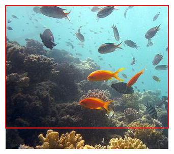
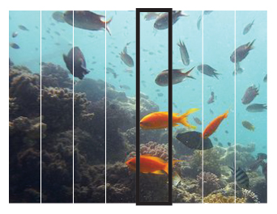
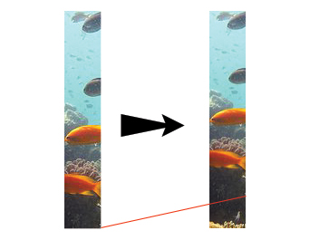
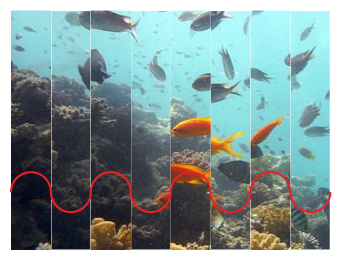

ActionScript is very well suited to creating old-school demo effects due to its rich drawing API and absence of memory management. Speed would have been a concern a few years ago, but as long as you’re not replicating Heaven7, current releases of Flash player should still be able to handle complex animations with minimal performance problems.

Let me show you a simple wave effect, reminiscing of looking at an object through a wall of water.

Demo effects require a program structure that redraws the entire screen several times every second. The faster the screen refresh, the smoother the resulting animation, at a commensurately higher computation penalty. While traditional languages like C require some kind of a timer mechanism, Flash abstracts away the timers into a frame-rate. We can set up a handler to listen to the ENTER\_FRAME event and refresh the screen every time it is triggered.

Demo effects implemented in C often use direct access to the display hardware for performance reasons. Since Flash does not provide direct access to physical devices, we must settle for using the BitmapData class as our drawing buffer and optimize our code within the bounds of its API.

But before we get around to simulating our effect, let us first spend some time understand the principles behind how it is created.

### The Sine Wave

A sine wave is mathematical function that plots a smooth, repetitive oscillation and is represented in its simplest form as y(t) = A · sin(ωt + Φ) where A is the amplitude or peak deviation of the function from its centre position, ω is the frequency and specifies how many oscillations occur in a unit time interval in radians per second and Φ is the phase, which specifies where the oscillation cycle begins when t = 0.

With this information we can create a simple function to plot a sine wave.

```actionscript
public function Draw(e:Event):void 
{
    var x1:Number = -1;
    var x2:Number = -1;
    var y1:int = -1;
    var y2:int = -1;
    var amplitude:Number = 120;
    var frequency:Number = 1 * Math.PI / 180; // Convert degree to radians

    for (x1 = 0; x1 < 320; x1++)
    {
        y1 = Math.round(amplitude * Math.sin(frequency * x1)) + 120;
        DrawingUtils.lineBresenham2(this.m_bd, x1, y1, x2, y2, 0xFF000000);
        x2 = x1;
        y2 = y1;
    }
}
```



We use [the Bresenham line drawing algorithm](/breaking-free-from-your-api/ "Breaking Free from Your API") instead of setPixel to plot the curve on the bitmap for better fidelity.

<figure>
  
  <figcaption>Image A: The image is taller than the red viewport</figcaption>
</figure>

### Creating Waves with Images

The same principles can be used to create a wave effect on an image. Instead of plotting points on a canvas, columns of an image are scaled up or down depending upon the shape of the wave. The image is scaled down at points where the wave forms a crest and scaled up wherever the wave forms a trough.

<figure>
  
  <figcaption>Image B: Extract a single vertical slice</figcaption>
</figure>

<figure>
  
  <figcaption>Image C: Scale the extracted portion</figcaption>
</figure>

<figure>
  
  <figcaption>Image D: Paste the slice back into the image</figcaption>
</figure>

Because of the scaling required, the image we use is larger than the viewable area. Image A illustrates this. The red outline is the viewable area of our movie, whereas the image used is taller than that. If the image is not tall enough you will see white patches at the bottom of the movie when the animation begins.

Each time the screen is to be refreshed, the function cycles over all the columns in the image. The columns are 1 pixel wide in the movie, but for illustration, image B shows the columns as 40 pixels wide. Image C shows how the extracted image column is then scaled down.

When all images are placed next to each other, they appear to make a wave, as shown in image D. While the effect looks very blocky in this illustration due to the wider column widths used, thinner columns used in the final movie give a smoother output.

Further fine-tuning can be done by changing the wavelength of the sine wave. A large value is used in the example below, causing all the columns in the image to shrink and expand at almost the same rate. A smaller value used in its place would have caused a broad discrepancy in the scaling values for each column. Having columns with both large and small values in the same frame would cause a wider range of distortion in the image, and speed up the motion. Effectively, frequency can be used to increase or decrease the speed of the animation, simulating choppy or calm waters as needed.

The function we use is as shown below.

```actionscript
public function Draw(e:Event):void
{
    var img:int;
    var wd:int;
    var y:Number;
    var mx:Matrix;

    for (y = 0; y < 240; y++)
    {
        img = 0; 
        wd = Math.round(Math.sin(aa) * 20) + 320;
        mx = new Matrix();
        mx.scale(1, wd / 320);

        this.m_bd.draw(this.m_rg[img], mx, null, null, new Rectangle(0, y, 320, 1), true);
        aa += 0.01;
    }

    aa = ab;
    ab += 1 * Math.PI / 180;
}
```



Underwater in Egypt used under CC [from http://www.flickr.com/photos/ehole/](http://www.flickr.com/photos/ehole/) / [CC BY 2.0](http://creativecommons.org/licenses/by/2.0/)

The only difference we need to make in our scaffolding code is to call the Draw effect repeatedly when trying to animate the wave effect, whereas drawing the sine wave can be done by calling the function just once on startup.

The entire codebase with both the effects and scaffolding code is [available for download here](wave-effects.zip). To change the effect shown, change the value of the m\_fxName variable in Main.as to either SineWave or WaveEffect. New effects can be added by extending the BaseEffect class and changing the value of the m\_fxName variable to the newly created class name.
