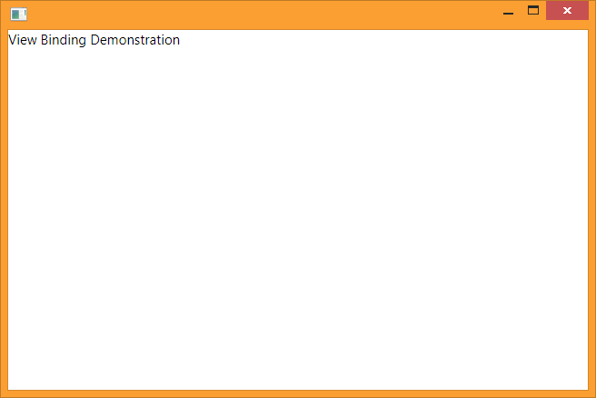
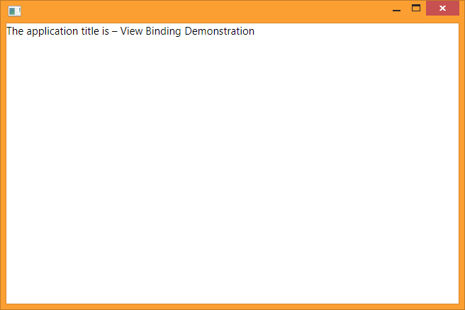

It turns out that there is a much better way to manipulate the user interface in WPF which is based on view-models. I cover this aspect in this episode of Building FitNet.

The System.Windows.Application class is the core of a WPF program. An instance of this class remains in memory for as long as the application is running. In order for the application to do something useful, programmers must extend this class and customise its behaviour to the needs of their own application. By convention, the primary application window is also instantiated by this class in the OnStartup event handler.

```csharp
private ShellViewModel _shellViewModel;

override public void OnStartup(StartupEventArgs e)
{
  base.OnStartup(e);
  _shellViewModel = new ShellViewModel();

  var window = new Shell();
  window.DataContext = _shellViewModel;
  window.Show();
}
```

An instance of the ShellViewModel class is assigned as the view-model for the application window through its DataContext property. When the properties in the view-model instance change, it dispatches a PropertyChanged event along with the name of the changed property. Corresponding event handlers in the window object then query the view-model for the new state and update the appearance of the display. The ShellViewModel class must implement the System.ComponentModel.INotifyPropertyChanged interface for this behaviour.

The following example illustrates this by changing the title of the application window.

```csharp
public class ShellViewModel
{
  ...
  public string Title
  {
   get
   {
     return _title;
   }

   set
   {
      _title = value;
     var e = new PropertyChangedEventArgs("Title");
     PropertyChanged(this, e);
    }
  }
}
```

Specific properties of the view are bound to their corresponding counterparts in the view-model. In this example, the Title property of the Window class is bound to its namesake in the view-model.

```xml
<Window ... Title="{Binding Path=Title}">
  ...
</Window>
```

Therefore, when the title changes on the view-model, the change gets reflected on the view. The key here is assigning an instance of the ShellViewModel to the DataContext property, which establishes the bindings between the view and the view-model.

This concept is key to understanding and implementing properly architected WPF applications.

#### Binding On-Screen Views

This concept of binding a view to data can be extended to any type. Primitive types are rendered as strings. For complex types, programmers can build composite views made up of several different fundamental UI elements such as labels, text fields and buttons. Properties in the view-model are bound to these controls.

In order to render the content in the window, the application must instantiate ContentControl, which is shipped along with WPF. This class has a property called Content, which can be bound to any property in the view-model.

```xml
<ContentControl Content="{Binding Title}"/>
```

The output of the program written so far is shown below.



When the value of Title in the view-model changes, the text rendered inside the ContentControl instance is updated to reflect the new text.

#### Building Compound User Interfaces

The third part of the equation is assigning a data template to the view, which describes the visual structure of an object. A data template is a window resource.

```xml
<Window...>
  <Window.Resources>
    <DataTemplate DataType="{Type system:String}">
      <TextBlock Text="{Binding StringFormat={}The application name is — {0}}"/>
    <DataTemplate>
  </Window.Resources>
  ...
</Window>
```

This modifies the appearance of the ContentControl instance. Instead of rendering plain text with just the name of the application, the output is decorated with some additional text and special characters, and looks like this.



### The Big Picture

Essentially, the outcome of what appears on the screen is now split into three classes – a view-model, a view, and a data template that specifies which determines which view to use to render a view-model.

It’s a small step from here to building complete user interfaces using this style of programming.

This is done by having a custom view-model class for the window as shown above, then adding another view-model to it as a public, bindable property called SelectedView.

```csharp
public class ShellViewModel
{
  ...
  private Object _selectedView;

  public Object SelectedView
  {
    get
    {
      return _selectedView;
    }

    set
    {
      if (value == _selectedView)
      {
        return;
      }

      _selectedView = value;
      OnPropertyChanged(nameof(SelectedView));
    }
  }
}
```

It is preferred that SelectedView be a custom type instead of System.Object. A different view-model is required for each view that the application needs to render. For example, if the application requires tabs for a calories consumed calculator and a speed calculator, then two view-models must be made for each of these tabs. Having a common base class between them ensures type-safety when switching between the two view-models.

A custom renderer is also required for each view. Renderers are typically built on top of the UserControl class. The declarative syntax of XAML makes it very easy to build a user interface with any kind of layout.

The example below shows a SpeedCalculatorView that computes the value of speed based on the time taken and distance covered.

```xml
<UserControl ...>
  <Grid>
    <Grid.ColumnDefinitions>
      <ColumnDefinition Width="150"/>
      <ColumnDefinition Width="250"/>
    </Grid.ColumnDefinitions>

    <Grid.RowDefinitions>
      <RowDefinition Height="Auto"/>
      <RowDefinition Height="Auto"/>
      <RowDefinition Height="Auto"/>
    </Grid.RowDefinitions>
    <TextBlock Grid.Column="0" Grid.Row="0" Text="Time"/>
    <TextBlock Grid.Column="0" Grid.Row="1" Text="Distance"/>
    <TextBlock Grid.Column="0" Grid.Row="2" Text="Speed"/>

    <TextBox Grid.Column="1" Grid.Row="0" Text="{Binding Time}"/>
    <TextBox Grid.Column="1" Grid.Row="1" Text="{Binding Distance}"/>
    <TextBox Grid.Column="1" Grid.Row="2" Text="{Binding Speed}"/>
  </Grid>
</UserControl>
```

The window resources contains a DataTemplate declaration to associate the SpeedCalculatorView with the SpeedCalculatorViewModel. The user interface is changed by setting the value of SelectedView in ShellViewModel to an instance of SpeedCalculatorViewModel.

In the next part, I will cover how to add interactivity to this application.
