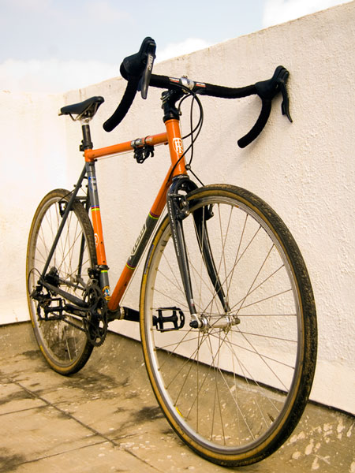

It is daunting to straddle a flimsy contraption of metal tubes and ride in the midst of two-ton behemoths. Without electric horns or 50-watt headlights, you're left to fume in silent, invisible panic every time a moron behind a wheel swerves into your lane without warning or reason.

Leaning down, hunched over and gripping a threadbare strip of cloth around the bars as cushion isn't exactly the lap of luxury. Your backside, spoiled over a lifetime of sitting astride soft surfaces, hurts from the hard saddle. Road surface contours become more pronounced. Whereas a twist of the throttle on a motorcycle barrels up the steepest of climbs with nary a sweat broken, your legs now scream for mercy at every upward incline. And you touch a breathtaking top speed of 40 kilometres per hour for a total of 30 seconds before your lungs collapse in sheer exhaustion. The slightest headwind multiplies your suffering by orders of magnitude, and the elusive tailwind never seems to appear. Let's not even talk about the inevitable, sweet suffering of DOMS the following day.

The cold wind bites hard, and sharp sun stings deep. But you wear the sun-tan with pride, even when it polarises your limbs, leaving you looking like a Frankensteinesque freak of mixed dark and light human componentry.

And yet you soldier on, all discomfort forgotten behind the stupidest grin on your face as you slice through empty streets on a Sunday morning ride. Because inside every motorcyclist there is a little boy who just wants to ride a bicycle all day.

Say hello, fellow riders, to Amaretto.
