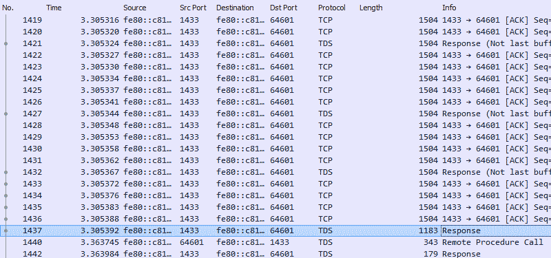
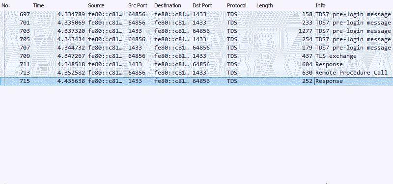

Some years ago, we had customers reporting poor network response time when fetching content from the server. Our product was not anywhere near being wildly popular, and the number of records in the database were still counted in tens of thousands. Even our puny instance was able to cache the entire database into memory. Not just a single table or the results of a few queries. The entire database could be cached in RAM. So the slowdown probably wasn't caused by something in the database. All customers reported more or less similar latency, irrespective of their geographical locations or internet service providers or time of the day. That also ruled out network problems.

So I rolled up my sleeves and began investigating.

One of the features of this product was that while it used sequential 128-bit integers for the primary key columns, the data retrieval was done with a shorter 5 character identifier, called a short-code. The short-code was also unique, but made up of fewer characters for legibility when users passed links around. The short-code wasn't appropriate for a primary key column though, as its randomness would cause too much index fragmentation.

The short-code was generated by hashing the primary key value using the MD5 algorithm, and truncating it to the first 5 characters of the result. If there was a collision...well nobody had thought about that back then. It was one of the subtle bugs that would come back to trouble us years later. But that's another story.

Someone had decided to implement this feature in the application code. When a content link was required, it was computed using .NET cryptography libraries and the result embedded into a URL string template for the user to share. The hashed value was not stored in the database, even though it was going to remain the same every time. And we would be paying heavily later for this oversight.

Now since the application had no way to identify the record directly by its short-code, the developers had to come up with a Rube Goldberg-esque contraption to retrieve it again. For this, they fetched the ID column for all the content records, ran the MD5 function on each row, truncated the result and compared it to the value given in the incoming request, until a match was found. The CS101 guys already know where we are getting at with this approach. Since everything is fast for small n, this technique worked flawlessly on the developers' own computers. It was only when the application was deployed to production, and stayed there for a few months, that the performance bottlenecks began to show up.

Locating the bug itself was easy. I set up a network trace using WireShark, inspecting the queries between the application and the database server, and promptly proceeded to fall of the chair in disbelief.

[](unoptimised.png)

After excluding essential communications such as handshakes and authorisation, the application was still receiving almost half a megabyte of data, split into 400 packets, for a table containing only 31,000 rows. All this activity before it could even begin looking for a match.

This was going to require some re-engineering to fix.

Due to unrelated reasons, our goal was only to reduce the amount of data being received from the database server with zero changes in the public API or modifications to the database tables. We could only change the application code and deploy a new build. This code was written to use ADO.NET and inline queries to perform data operations. So changing its behaviour was going to be relatively easy.

The first thing was to assemble a query that could generate the MD5 of an integer.

```
SELECT HASHBYTES('MD5', CAST([Article].[Id] AS CHAR(36))) AS [Hash]
FROM [Article]
WHERE [Article].[Id] = '6BA1CE84-FDB1-EA11-8269-C038960D1C7A';
```

Since the HASHBYTES function in T-SQL works only with char, nchar or binary data, the uniqueidentifier had to be cast into a fixed-width char. The output of this function was like so.

```
-- 0x704E87BA59EB6F930C020E5D6DA6B444
```

This hash was converted into a string by using the CONVERT function, and finally truncated to the first 5 characters, resulting in the output shown below.

```
SELECT LEFT(
            CONVERT(
                CHAR(32),
                HASHBYTES(
                    'MD5',
                    CAST([Article].[Id] AS CHAR(36))
                ), 2), 5) AS [Hash]
FROM [Article]
WHERE [Article].[Id] = '6BA1CE84-FDB1-EA11-8269-C038960D1C7A';
```

```
-- 704E8
```

Cool!

Now came the retrieval by the short-code. The hash-computation query was nested inside another simple select query.

```
SELECT *
FROM
(
    SELECT [Article].[Id],
           [Article].[Name] AS [ArticleName],
           LEFT(CONVERT(CHAR(32), HASHBYTES('MD5', CAST([Article].[Id] AS CHAR(36))), 2), 5) AS [Hash]
    FROM [Article]
) [Article_]
WHERE [Article_].[Hash] = '704E8';
```

This was executed against the database and measured again using WireShark.

[](optimised.png)

The results were remarkably different, but not at all unexpected. Only 882 bytes of data were transferred between the database and the application, and of that, 630 bytes were the query string going into the database server. The only record the server now returned was 252 bytes long, and required no further processing in the application.

There was still had a lot of processing going on in the database itself, which was still ripe for optimisation. Storing the short-code in the table permanently and indexing the column would improve the product's performance even further.

But for that moment, I was king of the world.

*This story has been altered slightly to protect the guilty and gloss over irrelevant details. The performance bottleneck was made much worse by nested loops (yay, quadratic growth!) and suboptimal data types.*
