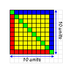
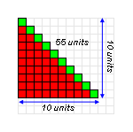
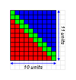

Project Euler is a collection of mathematical problems for the programmer who enjoys taxing his brain cells once in a while. The problems are ordered to be successively difficult to solve, which explains why, as of today, 91,510 people have solved problem one, while problem 283 is solved only by 9 people. Not only are they successively more taxing, but going through so many problems itself is a tedious task that requires mental stamina even when taken in installments over several days.

### Understanding the sum of numbers from 1 to N


Diagram A

Diagram A shows a square with each side 10 units long. A green diagonal cuts the square into two equal triangles. The number of squares making up the square equals 10 x 10 = 100.

Diagram B shows one half of the triangle, whose base and height are 10 units for a total of 55 cells. The number of cells can be calculated by adding the number of cells in each column, i.e. 10 + 9 + 8 + 7 + 6 + 5 + 4 + 3 + 2 + 1 = 55.

A similar blue triangle is placed above the red triangle in diagram C, in a way that both triangles are touching but do not overlap. Both triangles encompass 55 units and have sides of 10 units each. They combine to make a rectangle that is 10 units wide and 11 units tall. The total number of cells in the rectangle is 55 + 55 = 10 \* 11 = 110.


Diagram B

Thus it can be seen how the total number of cells in one triangle (i.e. N + (N - 1) + (N - 2)...+ 1) can be computed by calculating the area encompassed by a rectangle that is N \* (N + 1) and dividing the result by 2.

[Thanks Reddit!](http://www.reddit.com/r/math/comments/bbezn/help_needed_to_understand_summation_formula/)

The good part is that solving a problem helps an individual build an insight that is useful while solving another one later down the line.

The first problem in Project Euler asks to add all the natural numbers below 1000 which are multiples of 3 or 5. The straightforward way to resolve this is to use a loop from 1 to 999 that uses a modulus operation to evaluate each integer between 1 and 1000 with 3 and 5, adding the ones that are perfectly divisible and discarding the rest.


Diagram C

Here’s an implementation of this code in ActionScript.

```actionscript
var sum:uint = 0;
for (var i:uint = 1; i < 1000; i++)
    if ((0 == i % 3) || (0 == x % 5)) sum += i;
trace(sum);
```

But the secondary goal of these problems is to have an implementation that can return an answer in less than one minute. Problem one is not all that taxing for a modern computer, making even a naïve implementation run well within the required time frame. But complexity for later problems increases exponentially, making the selection of a fast algorithm very essential.

Hence, it is required that one should understand the mathematical principle behind each problem in order to write an efficient solution.

A step-by-step breakdown of the complex, but more efficient solution goes as follows.

The smallest multiple of 3 greater than 1 is 3 itself.

The largest multiple of 3 less than 1000 can be computed easily.

```actionscript
multiples = (1000 - 1) / 3
multiples = 333.33
multiples = floor(remainder)
multiples = 333
```

The floor() function is used to discard the decimal part of the result by mapping the real number into the previous smallest integer.

The result, 333, is the number of multiples of 3 between 1 and 1000. So the sum of these values can be computed by adding the multiples together.

```actionscript
(1 * 3) + (2 * 3) + (3 * 3)...+ (333 * 3)
= 3 (1 + 2 + 3...333)
```

The sum of numbers between 1 and n is n (n + 1) / 2. So the sum of 1 to 333 is 333 (333 + 1) / 2, which is 55,611. Multiplying that by 3 gives you 166,833, which is the sum of all multiples of 3 between 1 and 1000.

The same method can be used to compute the sum of multiples of 5 between 1 and 1,000, to get a result of 99,500.

The problem asks to compute the sum of multiples of 3 or 5. What we have done so far is compute the sum of multiples of 3 and 5. To remove the overlap between the two sets, compute the least common multiple of the two numbers, which is 15, and calculate the sum of multiples of that number between 1 and 1000. Subtracting that set from the first two will result in a set which contains numbers which are either multiples of 3 or 5 but not both.

The same principle also applies when the sum of multiples of 15 is deducted from the sum of multiples of 3 plus the sum of multiples of 5.

So your final solution is sumOfMultiples(3) + sumOfMultiples(5) - sumOfMultiples(15).

The complete implementation of the program is as follows.

```actionscript
package 
{
    import flash.display.Sprite;

    /**
     * Project Euler solutions entry point
     */
    public class Main extends Sprite 
    {
        public function Main():void 
        {
            var p:IProblem = new Problem1();
            trace(p.solve());
        }
    }
}

package  
{
    /**
     * If we list all the natural numbers below 10 that are
     * multiples of 3 or 5, we get 3, 5, 6 and 9. The sum
     * of these multiples is 23.
     * 
     * Find the sum of all the multiples of 3 or 5 below 1000.
     */
    public class Problem1 implements IProblem
    {
        public function solve():uint
        {
            var limit:uint = 999;
            trace((sumOfMultiples(3, limit) + sumOfMultiples(5, limit)) - sumOfMultiples(15, limit));
        }

        private function sumOfMultiples(factor:uint, limit:uint):uint
        {
            return factor * sum1toN(limit / factor);
        }

        private function sum1toN(n:uint):uint
        {
            return Math.round((n * (n + 1)) / 2);
        }
    }
}
```
