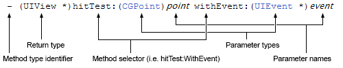

### A Different C with Classes

Objective-C is a different take at an object oriented implementation of C, and a rather elegant one at that. The language supports all the principles of the paradigm - inheritance, encapsulation and polymorphism. It is a strict superset of C, which is a fancy way of saying that all C code is already valid Objective-C code, and C code can be freely interspersed within an Objective-C program (and yes, you also have to deal with pointers). Objective-C compilers can compile code from both languages without trouble. While the language is staple among developers using OS X and iOS, it is perfectly suited for general purpose programming as well. However, thinking in Objective-C requires getting used to its unique syntax and an eclectic model of programming that infuses Smalltalk-style messaging, C-style statements and modern OO constructs such as protocols, understanding the role of the language runtime, and getting your head around slightly different terminology.

And since large Objective-C applications are typically written for Apple's ecosystem, being able to converse in Cocoa is not half bad a thought. This primer assumes you already know terminology such as classes, objects and methods. With that in mind, we move on to introducing the Objective-C syntax for writing class-based code.

### Classes and Instances

A class is split into two files - a header and an implementation. Let's begin with a Shape class that we will flesh out and use through the rest of this document.

```objc
// Shape.h
@interface Shape

@end
```

This file declares the public interface of the Shape class. The language loves its '@' symbols, so get used to them. You'll be using them more often than you think (just one of the eccentricities of the language). The implementation is stored in Shape.m and is written as follows.

```objc
// Shape.m
#import "Shape.h"

@implementation Shape

@end
```

This is very similar to how one might structure files in C.

You need to instantiate an object in order to do anything with it. However, the language does not have traditional constructors like in C#. Instead, the base NSObject class implements two separate methods for object allocation and initialization - alloc and init.

```objc
Shape *s = [[Shape alloc] init];
```

> Note: Separating the interface from the implementation might seem like a lot of effort, but it is one of the traits that Objective-C inherits from C. The advantages and disadvantages of this approach have been debated in many texts and discussion forums, which I encourage you to read. They are interesting in their own right and provide a valuable background to getting under the skin of the language.

This statement allocates memory for an instance of the Shape class and initializes the object. It can also be simplified into a single message.

```objc
Shape *s = [Shape new];
```

In both the above examples, alloc and new are class methods (also known as static methods). The init method is also implemented by the base class, but it is an instance method. Classes can override or implement their own versions of initializers.

#### A look into the past

The history of this two-step construction can be traced back to the days of NeXTSTEP, when the language was still in its infancy. The tight memory constraints of the hardware at that time often necessitated memory pooling. By separating allocation from initialization, programmers were able to reuse preinstantiated objects after reinitializing them. The practice continues today because it leaves programmers free to create custom initializers for their classes while gaining the benefits of a pre-written, generic and performant allocation method.

> New allocation methods are seldom created because the existing methods meet almost every need. However, one or more new initializers are created for almost every class. Due to the separation of allocation and initialization stages, initializer implementations only have to deal with the variables of new instances and can completely ignore the issues surrounding allocation.The separation simplifies the process of writing initializers. - **Erik M. Buck and Donald A. Yacktman, Cocoa Design Patterns**

### Messages

> *Procedural code gets information then makes decisions. Object-oriented code tells objects to do things.* - **Alec Sharp**

Sending messages to objects imbibes the philosophy of tell, don't ask as championed by Sharp. A message in Objective-C is identified by the enclosing brackets ([ and ]) around the message name and the receiver. Messages are sent by clients to instances or classes. Objects contain methods to handle those messages. Messages have a method type - either instance or class (denoted by the - and + symbols, respectively). Message signatures must declare a return type (or void if they return nothing), and the types of all parameters.


The syntax of a method declaration

All messages are declared in the class interface. The definitions are stored in the implementation.

```objc
// Shape.h
@interface Shape

- (void)scaleX:(double)x Y:(double)y;

- (void)rotate:(double)radians;

- (void)translateX:(double)x Y:(double)y;

@end
```

```objc
// Shape.m
#import "Shape.h"

@implementation Shape

- (void)scaleX(double)x Y:(double)y {
    // Scale this object
}

- (void)rotate:(double)radians {
    // Rotate this object
}

- (double)translateX:(double)x Y:(double)y {
  // Translate this object
}

@end
```

Finally, the object is instantiated and called upon by a client class.

```objc
#import "Shape.h"

...
Shape *rect = [[Shape alloc] init];
[rect translateX:20 Y:30];
...
```

Messages are invoked upon an object instance through the unique double square-bracketed syntax of the language. The first token is the name of the object, the second the name of the message being passed. Each subsequent token is separated by a colon and denotes a parameter to be passed to the message.

#### Dissecting Messages

Dynamic messaging is one of the primary enhancements of Objective-C over plain C. Rather than being bound statically at compile time, messages are resolved at runtime by the language runtime. The message itself is identified by a selector, which is a null-terminated string that contains the name of the method. The selector points to a C function pointer that implements the method. An Objective-C call...

```objc
[rect translateX:20 Y:30];
```

is compiled into...

```objc
objc_msgSend(rect, @selector(translateX:Y:), 20, 30);
```

While the internals of how a message is sent are not essential, some overview is useful when writing and debugging code.

In the example above, a Shape instance is initialized and its reference stored in the variable 'rect'. It is then sent a message to move it 20 pixels on the X axis and 30 pixels on the Y axis. The message selector to effect the move is the string "translateX:Y:". When the language runtime attempts to send the message to the object, it uses the entire string as the selector.

It is understandably easy to misinterpret the selector name to be a method name along with its named parameters. But it becomes clear once you read the objc\_msgSend function call that Objective-C does not work this way.

A programmer can dispatch any message to an object. While the compiler will identify and warn of a potentially unsupported message, the program itself will compile. While this does seem error-prone, there is a method (heh heh) behind the madness.

Methods can be added or replaced on instances at runtime. The compiler cannot possibly identify which messages are going to be supported by an object when the program executes, due to which it allows sending messages which are not defined in the scope of the class interface.

When the program is executed, the runtime introspects the object to see if it can handle the message or not. If the object receives a message it cannot handle, the system will generate a runtime exception and your program will stop.

### Declared Properties

Declared properties correspond to auto-implemented properties in C#. Unless explicitly overridden, the public interface to properties is automatically generated by the compiler.

```objc
// Shape.h
...
@interface Shape : NSObject
@property double width;
@property double height;
...
@end
```

This is the bare minimum that you need to write in order to implement properties in your class instance. The compiler automatically generates accessors and mutators for you. An accessor has the same name as the property name (width and height in this case) and the mutator is the property name capitalized and prefixed with the word 'set' (setWidth and setHeight).

```objc
// Shape.m
@implementation Shape
@synthesize width;
@synthesize height;
...
@end
```

To access the properties, clients can use the following syntax.

```objc
// Client.m
...
NSLog("width: %d, height: %d", [rect width], [rect height]);
[rect setWidth:30];
[rect setHeight: 22];
...
```

Properties can also be accessed through an alternative dot syntax.

```objc
// Client.m
...
rect.width = 20;
NSLog("height: %d", rect.height);
...
```

#### Property Attributes

Property declarations can be embellished in the interface with attributes in order to control how they work. There is no change required in the implementation.

```objc
// Shape.h
...
@property (readonly) double width;
...
```

The readonly attribute makes the property only viewable. The compiler flags any attempts to call setWidth as errors and stops the compilation process. While property attributes have many subtleties that must be thoroughly understood in order to master the feature, beginners can go with the most general guidelines.

##### Storage

- Use assign for scalar properties (native numeric types, structs, enums).
- Use retain for object types (NSString, NSNumber, etc.). Creates a new reference to the object instance and releases the old one.
- Use copy for object types. Creates a new instance based on the properties of the old one. Releases the old instance.
- Use strong for object types that increment reference counts. This is the recommended technique for objects at the top of a hierarchy to reference their child objects. This ensures that the child objects will not be cleared as long as the parent object exists.
- Use the weak attribute for references to parent objects from child objects. If the parent object is destroyed, its reference in the child object is automatically cleared off and prevents memory leaks.

##### Mutability

- The readonly attribute makes a property immutable. Outside classes cannot modify its value. The class itself also cannot make any changes through the property mutator (since there isn't one), but can change the value of the underlying field directly.
- The readwrite attribute makes a property mutable by outside classes by auto-generating the mutator and accessor methods.

##### Concurrency

- Non-threadsafe code can get away with using nonatomic properties.
- Use atomic for properties that must work in a multithreaded environment.

##### API

- The getter attribute explicitly declares the name of the accessor method. Use this to override the default name of the accessor.
- The setter attribute works similarly to declare the name of the mutator method.

### Instance Variables

A field in C# corresponds to instance variables (or ivars) in Objective-C. An instance variable exists throughout the lifetime of the object and is accessible within the scope of the objects methods - public and private. Outside classes cannot access an ivar directly.

```objc
// Shape.h
@interface Shape : NSObject {
  int _width;
  int _height;
}
...
@end
```

The compiler can automatically synthesize ivars for properties. The auto-generated variable has the same name as the property, prefixed by an underscore (\_). This can be overridden in the implementation file using the @synthesize statement to link them to explicitly declared variables.

```objc
// Shape.m
#import "Shape.h"

@implementation Shape @synthesize width = myWidth; ... @end
```

### Protocols

Protocols correspond to interfaces in C#. They are header files which declare a list of method signatures. Developers can declare that a class implements those methods in the header file. The compiler checks this and flags any classes that do not implement those methods.

Classes that implement all methods declared in a protocol fully are said to conform to it.

```objc
// FilledShape.h
@protocol FilledShape

- (void)setFill(Fill *)fill;

- (void)clearFill;

@end
```

The Shape class can declare that it conforms to the FilledShape protocol by following its class name with the name of the protocol.

```objc
// Shape.h
#import "FilledShape.h"

@interface Shape : NSObject <FilledShape> ... @end
```

Classes can implement as many protocols as required. Each protocol name should be separated by a comma within the two angled brackets (<>).

```objc
// Shape.h
#import "FilledShape.h"
#import "OutlinedShape.h"

@interface Shape : NSObject <FilledShape, OutlinedShape>
...
@end
```

Objective-C protocols offer the option of declaring required and optional methods. This makes it possible to write classes that implement only some, but not all methods of a certain interface. While this again does seem like a code smell to many programmers, it does come in handy given the dynamic nature of Objective-C.

All methods declared in a protocol are public. Protocols cannot define private methods.

### In Closing

Like many other languages, the syntax and many features of Objective-C are fairly easy to grasp. Apple's excellent implementation of the Foundation Framework, UIKit and Cocoa frameworks make it easy even for novices to write significant applications without much effort. But like everything else, true mastery comes only with practice and an understanding of the underlying runtime that powers the language.

Additionally, while OOP is great for increasing productivity, developers must also take time out to grasp the C underpinnings that form the foundation of Objective-C. This knowledge not only makes for a well-rounded education of the language, but also opens up the ability to harness the raw power of C when necessary, which is an important benefit of Objective-C.
