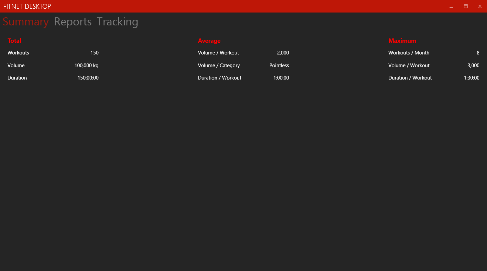
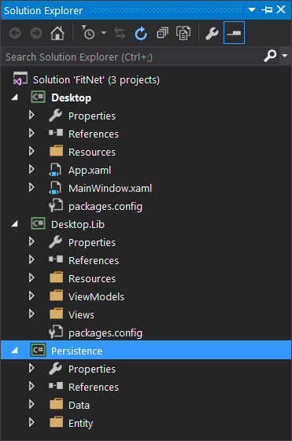

In the previous post I described the rationale and the approach to building a custom fitness tracker for the desktop. The application was to be built using the Windows Presentation Foundation. As far as execution goes, I had a lot to learn about the correct way to use WPF. The first commit of the application followed so many WinForms paradigms that it made zero sense to involve the overhead of WPF.



This is what the XAML that implements the above screen looked like.

```xml
<TabControl>
     <TabItem Header="Summary">
         <fit:Summary/>
     </TabItem>
     <TabItem Header="Reports">
         <Label>Reports View</Label>
     </TabItem>
     <TabItem Header="Tracking">
         <Label>Tracking View</Label>
     </TabItem>
</TabControl>
```

Perfectly readable, but it would quickly devolve either into a big ball of mud with XML nodes nested several layers deep in a single file, or turn into a pile of nested classes inheriting unrelated behaviour from a few common base classes. Either case was unacceptable. But I didn't know that yet.

The second mistake was borrowing a data-access implementation from a previous project which was based on a primitive architecture. The template pattern that this layer implemented was fine for a small number of data objects. But it becomes tedious to build a separate reader and writer sub-class and its associated ancillary classes for every aggregate data type (and FitNet requires quite a few of those). I needed something that was easier to extend when it came to data access.



The third major flaw was having monolithic namespaces out of ignorance of the WPF architectural style, and not using its paradigms to the best benefit. This resulted in the application turning into three projects - a Desktop project as the primary executable, a Desktop.Lib library project as a massive collection of view classes, and a Persistence project which implemented the aforementioned half-functioning data access layer.

I went through this path for several weeks before finally realising my folly, by which time I had actually built quite a bit of useful functionality in the application. But it was getting unwieldy to make any modifications or add new functionality. It seemed like I was constantly fighting against the framework in order to get things done.

I had finally had enough of this struggle when I had to implement a flyout for modifying the list of exercises in the database. Adding yet another node to the already crowded main window file and more inline click event handlers in the backing CS file were a clear indicator that I was doing this wrong. There was no way this could scale up elegantly.

This is where I decided to take a step back and try to understand what the heck was going on.

Fortunately I stumbled upon XPence, an expense tracking application built on WPF by Siddhartha S. and hosted with an in-depth development tutorial on Code Project.

Hang on for the next part where I finally begin to turn this ship around to a more meaningful course.
