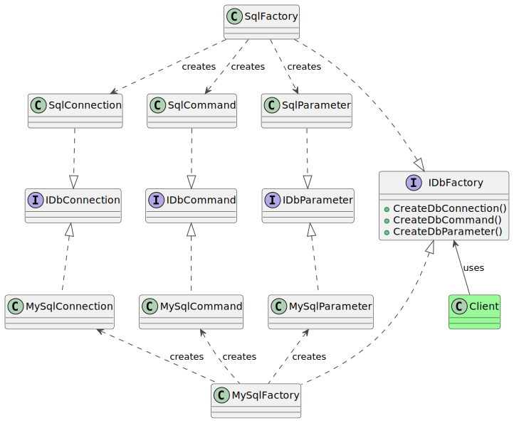

### Intent

The abstract factory design pattern provides an interface to create instances of related objects without directly specifying their concrete classes. This pattern is a superset of the factory method design pattern, as it separates the creation of an object from consumption, while adding the necessary checks to ensure that only related types of objects can be instantiated at a given time.

### Problem

In this example, we look at an application that offers options to  connect to SQL Server or MySQL database engines to store its data. A rudimentary way of  implementing this functionality is to pepper the code with if-else statements throughout the application, which is impractical, brittle and error prone – all traits to avoid in good code.

The source code for this design pattern, and all the others, can be viewed in the [Practical Design Patterns](https://github.com/pranavnegandhi/PracticalDesignPatterns) repository.

A database operation requires types to make a connection to the  database, a command to contain the query and a type to hold a query  parameter. All three have to belong to the same family in order to  operate correctly. Swapping any type of them for a type from another  family is not allowed. E.g. a MySQL connection instance will not be able  to operate with a SQL Server command instance. Therefore, if a program  has to offer the ability to work with various types of database engines, it has to guarantee that only compatible types are instantiated at a given time.



### Solution

This pattern consists of at least 2 types – one to define the factory interface, and a concrete factory class that implements this interface. More families of related objects are added to the application by implementing more factories.

The core API is provided by the IDbFactory interface.

```csharp
public interface IDbFactory
{
    IDbConnection CreateDbConnection();

    IDbCommand CreateDbCommand();

    IDbDataParameter CreateDbDataParameter();
}
```

`IDbFactory` defines methods for the database factory.  `IDbConnection`, `IDbCommand` and `IDbDataParameter` are interfaces provided by the framework in the `System.Data` namespace. All major third-party database vendors provide bindings for their engines which are compatible with these interfaces.

#### SQL Server Factory 

When the application has to operate against SQL Server, it instantiates the `SqlFactory` class, which implements the `IDbFactory` interface, and returns the SQL Server-specific concrete types for `IDbConnection`, `IDbCommand` and `IDbDataParameter`.

```csharp
public class SqlFactory : IDbFactory
{
    public IDbConnection CreateDbConnection()
    {
        return new System.Data.SqlClient.SqlConnection();
    }

    public IDbCommand CreateDbCommand()
    {
        return new System.Data.SqlClient.SqlDbCommand();
    }

    public IDbDataParameter CreateDbDataParmeter()
    {
        return new System.Data.SqlClient.SqlParameter();
    }
}
```

#### MySQL Factory

The `MySqlFactory` class operates in the same way and returns objects from the `MySql.Data.MySqlClient` namespace.

```csharp
public class MySqlFactory : IDbFactory
{
    public IDbConnection CreateDbConnection()
    {
        return new MySql.Data.MySqlClient.MySqlConnection();
    }

    public IDbCommand CreateDbCommand()
    {
        return new MySql.Data.MySqlClient.MySqlCommand();
    }

    public IDbDataParameter CreateDbDataParameter()
    {
        return new MySql.Data.MySqlClient.MySqlParameter();
    }
}
```

#### Usage

When the application is launched, it determines the database engine it has to operate against (through UI or configuration or some other means), and then instantiates the appropriate `IDbFactory` implementation. All objects required to operate on the database are subsequently instantiated from this `IDbFactory` instance.

```csharp
public class Program
{
    public static void Main(string[] args)
    {
        IDbFactory factory;

        if ("sql" == args[1])
        {
            factory = new SqlFactory();
        }
        else
        {
            factory = new MySqlFactory();
        }

        using (var connection = factory.CreateDbConnection())
        {
            connection.Open();
            var command = factory.CreateDbCommand();
            command.Connection = connection;
            command.CommandText = "SELECT * FROM [Users] WHERE [UserId] = ?";
            var param = factory.CreateDbDataParameter();
            param.DbType = DbType.Int32;
            param.Value = 42;
            command.Parameters.Add(param);

            command.ExecuteReader();
        }
    }
}
```
