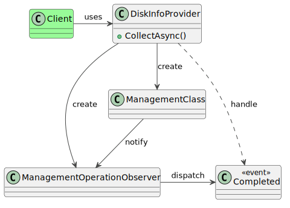

### Intent

The intent of this pattern is to convert the API to an existing library, usually to encapsulate legacy code, simplify its use or provide an alternative output format, into a different interface that a client expects.

The source code for this design pattern, and all the others, can be viewed in the [Practical Design Patterns](https://github.com/pranavnegandhi/PracticalDesignPatterns) repository.

### Solution

There are many examples of this interface in the real world. Cross-platform GUI toolkits are adapters around the underlying API for each supported platform. Clients can continue to use the API provided by GTK+, Windows Forms or Qt, for their applications that run on Windows, macOS or GNOME. The library takes care of translating the API invocations into native equivalents.

There are many simpler examples of the adapter pattern. A data-driven website is an adapter. It lets web browsers retrieve contents from a database over HTTP instead of running SQL queries on the database engine. It converts the API from SQL to HTTP.



Modern-day C# applications are often built around the task-based asynchronous pattern, but may need to utilise legacy frameworks or libraries that do not have task-based APIs. The Windows Management Instrumentation (WMI) API is a good example. The `ManagementClass` and `ManagementOperationObserver` types work collectively to query the WMI database and raise an event when the results are retrieved.

```csharp
public class WmiClient
{
  public void GetDiskData()
  {
    var management = new ManagementClass("Win32_LogicalDisk");
    var watcher = new ManagementOperationObserver();
    watcher.Completed += WatcherCompletedHandler;
    management.GetInstances(watcher);
  }

  private void WatcherCompletedHandler(object sender, CompletedEventArgs e)
  {
    // Consume the results of the operation.
    ...
  }
}
```

The code below illustrates how an adapter can convert this into a task-based asynchronous interface.

```csharp
public class DiskInfoProvider
{
  public async Task<PropertyDataCollection> CollectAsync()
  {
    var tcs = new TaskCompletionSource<PropertyDataCollection>();
    var watcher = new ManagementOperationObserver();

    // The event handler that gets invoked by the watcher.
    var completedHandler = default(CompletedEventHandler);
    completedHandler = new CompletedEventHandler((sender, e) =>
    {
      var tcsLocal = tcs;
      try
      {
        if (e.Status == ManagementStatus.NoError)
        {
          // The operation was completed without any errors.
          tcsLocal.SetResult(e.StatusObject.Properties);
          return;
        }

        if (e.Status == ManagementStatus.CallCanceled || e.Status == ManagementStatus.OperationCanceled)
        {
          // The task was cancelled before it could be completed.
          tcsLocal.SetCanceled();
          return;
        }

        // An exception occurred during the operation.
        tcsLocal.SetException(new Exception($"Runtime error {e.Status}"));
        return;
      }
      finally
      {
        // Clean up the event handlers.
        watcher.Completed -= completedHandler;
      }
    });

    // Wire up the event handler and begin the operation.
    watcher.Completed += completedHandler;
    var management = new ManagementClass("Win32_LogicalDisk");
    management.GetInstances(watcher);
    return tcs.Task;
  }
}
```

`DiskInfoProvider` encapsulates `ManagementOperationObserver` and `ManagementClass`. The client instantiates `DiskInfoProvider` and awaits the results from `CollectAsync()`.

```csharp
public class WmiClient
{
  public void GetDiskData()
  {
    var provider = new DiskInfoProvider();
    var diskProperties = await provider.CollectAsync();
  }
}
```

Many structural patterns serve similar roles, but have a singular differentiator between themselves. Adapters and proxies are at parallel purpose to each other. A proxy provides a matching replacement to all or most of its underlying API. An adapter changes the API to meet the client's requirement.
