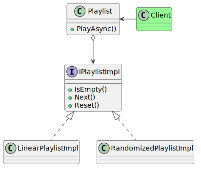

### Intent

The bridge pattern is designed to separate the implementation of a functionality from its interface. The benefits of this approach are seen when the functionality has multiple implementations which can be swapped out without changing the API. But the separation of concerns can also prove useful when the system is backed by only a single implementation. The client API can continue to remain stable even if the entire implementation changes, because the client is shielded from its effects.

The source code for this design pattern, and all the others, can be viewed in the [Practical Design Patterns](https://github.com/pranavnegandhi/PracticalDesignPatterns) repository.

### Solution

This example demonstrates the use of this pattern by building a playlist which stores and cycles through audio tracks. Tracks can be retrieved in linear or random order. The playlist can either stop after it has cycled over all the items, or loop back and begin afresh.

```csharp
public class Playlist
{
    private readonly IPlaylistImpl _playlistImpl;

    public async Task PlayAsync()
    {
        ...
        var item = _playlistImpl.Next();
        while (item != null)
        {
            // Perform an operation on the item.
            ...

            // Pick the next item.
            item = _playlistImpl.Next();
        }
    }
}
```

This class defines the public API of the playlist. The client populates the audio tracks through the usual collection API (not shown here), after which it invokes the `PlayAsync` method to start iterating through the list. Once it reaches the end of the list, it stops.



This is coupled with the implementation, defined by the `IPlaylistImpl` interface, and referenced by the `_playlistImpl` field.

```csharp
public interface IPlaylistImpl
{
    bool IsEmpty();

    string Next();

    void Reset();
}
```

This interface is implemented by the `LinearPlaylistImpl` and `RandomizedPlaylistImpl` classes, each of which approaches the collection of items differently. The linear playlist iterates over each audio track in the same order that they are stored in the items array.

```csharp
public class LinearPlaylistImpl : IPlaylistImpl
{
    private readonly string[] _items;

    private readonly IEnumerator _enumerator;

    public LinearPlaylistImpl(IEnumerable<string> items)
    {
        _items = items.ToArray();
        _enumerator = _items.GetEnumerator();
    }

    public bool IsEmpty()
    {
        return _items.Count() == 0;
    }

    public string Next()
    {
        if (_enumerator.MoveNext())
        {
            return _enumerator.Current as string;
        }

        return null;
    }

    public void Reset()
    {
        _enumerator.Reset();
    }
}
```

The randomized playlist picks an item at random from the list, marks it visited so it is not repeated, and stops after all audio tracks have been visited.

```csharp
public class RandomizedPlaylistImpl : IPlaylistImpl
{
    private readonly List<string> _items;

    private readonly Random _random = new Random((int)DateTime.Now.Ticks);

    private readonly Queue<string> _usedItems;

    public RandomizedPlaylistImpl(IEnumerable<string> items)
    {
        _items = new List<string>(items);
        _usedItems = new Queue<string>();
    }

    public bool IsEmpty()
    {
        var c1 = _items.Count;
        var c2 = _usedItems.Count;

        return c1 + c2 == 0;
    }

    public string Next()
    {
        if (_items.Count > 0)
        {
            var index = _random.Next(_items.Count);
            var item = _items[index];
            _items.Remove(item);
            _usedItems.Enqueue(item);

            return item;
        }

        return null;
    }

    public void Reset()
    {
        while (_usedItems.Count > 0)
        {
            var item = _usedItems.Dequeue();
            _items.Add(item);
        }
    }
}
```

#### Emergent Behaviour

The real magic of this approach becomes more evident once you add looping to the Playlist class. Since the effect of looping is the same on all implementations, it is best stored in the Playlist itself.

```csharp
public class Playlist
{
    ...
    public bool IsLooping()
    {
        get;
        set;
    }
    ...
}
```

When all items have been iterated through, the state of this property is checked. If looping is not enabled, the playback loop exits. If it is set, the playlist implementation is reset back to the first index and the iteration process is begun afresh.
