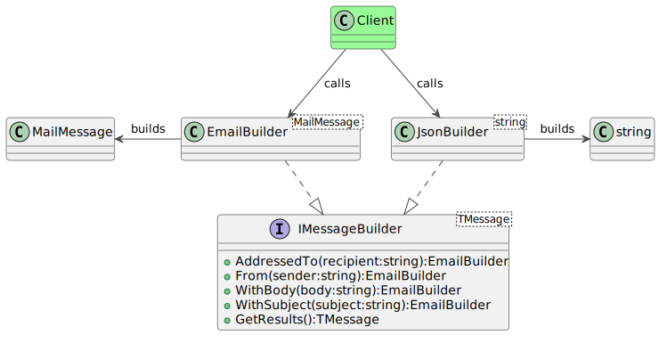

### Intent

The builder pattern abstracts multiple steps required to create a complex object into a coherent interface. Objects that need several input parameters are prime candidates for refactoring behind a builder object.

The source code for this design pattern, and all the others, can be viewed in the [Practical Design Patterns](https://github.com/pranavnegandhi/PracticalDesignPatterns) repository.

### Problem

To understand the benefits of this pattern, we must first analyse some code that does not utilise it.

```csharp
var message = new MailMessage("john@example.com",
                "jane@example.com",
                "101 Ways to Refactor",
                "Lorem ipsu...");
```

Quick, can you identify what is each parameter in this statement? Is John the sender or recipient? How do you add more than one recipient? How does one create HTML-formatted email? These questions are not immediately obvious. And adding more configurability into the MailMessage class would make for ever longer constructor calls.

A more readable alternative is clearly required, at least to retain the maintenance programmer's sanity for the future. And there's our hook for the builder pattern.



### Solution

The fundamental type in this example is the builder itself, EmailBuilder in this case. This class separates the components of the message into discrete methods.

```csharp
public class EmailBuilder
{
    private MailMessage _message;

    public EmailBuilder()
    {
        _message = new MailMessage();
    }

    public EmailBuilder AddressedTo(string recipient)
    {
        ...
    }

    public EmailBuilder From(string sender)
    {
        ...
    }

    public EmailBuilder WithBody(string body)
    {
        ...
    }

    public EmailBuilder WithSubject(string subject)
    {
        ...
    }

    public MailMessage GetResults()
    {
        return _message;
    }
}
```

The client code consumes this interface by invoking each method one after the other. All methods in the builder class return the instance itself (i.e. this) so that multiple methods can be chained together into a single, fluid statement.

```csharp
var builder = new EmailBuilder();
var message = builder.From("john@example.com")
    .AddressedTo("jane@example.com")
    .AddressedTo("jim@example.com")
    .WithSubject("101 Ways to Refactor")
    .WithBody("Lorem ipsu...")
    .GetResults();
```

This simple class already makes the code exponentially readable and maintainable. But there's more!

What if the program has to create multiple types of messages, such as an email plus a browser notification encoded into a JSON object? The API from the EmailBuilder can be easily extracted into an IMessageBuilder interface, then applied to different types of builders.

```csharp
public interface IMessageBuilder<T>
{
    IMessageBuilder WithSubject(string subject);

    IMessageBuilder<T> WithBody(string body);

    IMessageBuilder<T> From(string sender);

    IMessageBuilder<T> AddressedTo(string recipient);

    T GetResults();
 }
```

This is a generic interface as the return type of each builder differs, depending on the type of message it creates. As a result, the EmailBuilder class definition and method signatures change as shown below. Any code that consumes this class is not affected.

```csharp
public class EmailBuilder : IMessageBuilder<MailMessage>
{
    private MailMessage _message;

    public EmailBuilder()
    {
        _message = new MailMessage();
    }

    public IMessageBuilder<MailMessage> AddressedTo(string recipient)
    {
        ...
    }

    public IMessageBuilder<MailMessage> From(string sender)
    {
        ...
    }

    public IMessageBuilder<MailMessage> WithBody(string body)
    {
        ...
    }

    public IMessageBuilder<MailMessage> WithSubject(string subject)
    {
        ...
    }

    public MailMessage GetResults()
    {
        return _message;
    }
}
```

This done, we can move on to the JSON builder. For this example, we use types defined in the wildly popular Json.NET library from Newtonsoft.

```csharp
public class JsonBuilder : IMessageBuilder<string>
{
    private StringBuilder _builder;

    private JsonTextWriter _writer;

    public JsonBuilder()
    {
        _builder = new StringBuilder();
        var sw = new StringWriter(_builder);
        _writer = new JsonTextWriter(sw);
        _writer.WriteStartObject();
    }

    public IMessageBuilder<string> AddressedTo(string recipient)
    {
        _writer.WritePropertyName("AddressedTo");
        _writer.WriteValue(recipient);
        return this;
    }

    public IMessageBuilder<string> From(string sender)
    {
        _writer.WritePropertyName("From");
        _writer.WriteValue(sender);
        return this;
    }

    public IMessageBuilder<string> WithBody(string body)
    {
        _writer.WritePropertyName("Body");
        _writer.WriteValue(body);
        return this;
    }

    public IMessageBuilder<string> WithSubject(string subject)
    {
        _writer.WritePropertyName("Subject");
        _writer.WriteValue(subject);
        return this;
    }

    public string Build()
    {
        _writer.WriteEndObject();
        return _builder.ToString();
    }
}
```

The client code must instantiate the JsonBuilder and invoke the same methods on it as it does on any other builder. Each builder can have its own customisations, such as only storing a single recipient's name in the JSON object, which gets overwritten by any subsequent call to AddressedTo().

```csharp
var builder = new JsonBuilder();
var message = builder.From("john@example.com")
    .AddressedTo("jane@example.com")
    .AddressedTo("jim@example.com")
    .WithSubject("101 Ways to Refactor")
    .WithBody("Lorem ipsu...")
    .GetResults();
```
