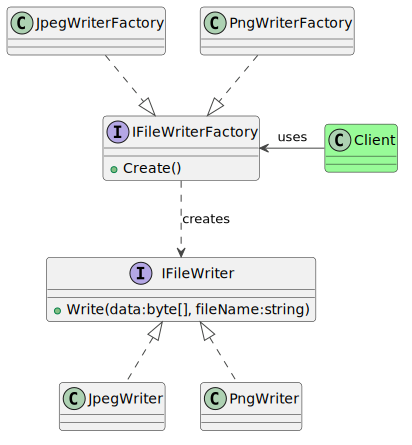

### Intent

The factory method is exactly what is says on the label - a method that produces object instances on demand. Ergo, a factory method. The intent of this pattern is to implement a method (in class or instance scope) that separates the creation of object instances from the consumption. It is often used to lazily instantiate objects during dependency injection. The factory method is the foundation to the abstract factory.

### Problem

In this example, we look at an application that has to write data to one of two different file formats. The format is selected at runtime through some kind of user input. The application should be able to select the appropriate file encoder, and request it to serialize the data.

### Solution

Separate file writer classes are required for each format, but both must share a common interface. The correct class is instantiated, and its `Write` method is invoked to perform the save operation.



The source code for this design pattern, and all the others, can be viewed in the [Practical Design Patterns](https://github.com/pranavnegandhi/PracticalDesignPatterns) repository.

All writer classes are required to implement the `IFileWriter` interface.

```csharp
public interface IFileWriter
{
    void Write(byte[] data, string filename);
}
```

This interface is implemented by each writer class. The example below shows the `JpegWriter` and `PngWriter` classes.

```csharp
public class JpegWriter : IFileWriter
{
    void Write(byte[] data, string filename) { ... }
}
```

```csharp
public class PngWriter : IFileWriter
{
    void Write(byte[] data, string filename) { ... }
}
```

Then a factory interface is declared, and a factory class created for each file type.

```csharp
public interface IFileWriterFactory
{
    public IFileWriter Create();
}
```

```csharp
public class JpegWriterFactory : IFileWriterFactory
{
    public Create()
    {
        return new JpegWriter();
    }
}
```

```csharp
public class PngWriterFactory : IFileWriterFactory
{
    public Create()
    {
        return new PngWriter();
    }
}
```

#### Usage

The application determines the file type that is required, then invokes the Create method on the appropriate writer factory, which in turn returns a concrete implementation of the IFileWriter class.

The application then invokes the Write method on the writer instance, which handles format-specific details such as endianness, file headers, encoding and more.

```csharp
static class Program
{
    private static _jpegWriterFactory = new JpegWriterFactory();

    private static _pngWriterFactory = new PngWriterFactory();

    static void Main()
    {
        // Image created and serialized into byte[]
        ...

        IFileWriter writer;
        if ("jpg" == args[1])
        {
            writer = _jpegWriterFactory.Create();
        }
        else
        {
            writer = _pngWriterFactory.Create();
        }

        writer.Write(data, "lena");
    }
}
```
