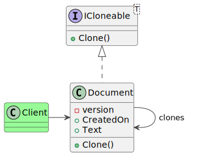

### Intent

The prototype pattern simplifies creating instances of a class by copying the contents of an existing instance to create a new one. This alleviates the cost of any expensive computation or I/O being performed in the constructor, or simply copies over the state of an existing object to the new instance for further modification.

The source code for this design pattern, and all the others, can be viewed in the [Practical Design Patterns](https://github.com/pranavnegandhi/PracticalDesignPatterns) repository.

### Problem

This article demonstrates a document editor that has the ability to make and display multiple concurrent snap shots of a document. Each can be reviewed and edited individually and compared with each other. The process begins with a single document in memory, which the user can edit before cloning. When a draft is ready, the user duplicates the object by invoking a command from the UI. This copies the contents of the document over into a new instance. The document also contains a date and time field which is modified to match the time when the duplicate is created.



Both versions now exist in memory simultaneously and the user can cycle between them as needed.

### Solution

For this, there must be a way for the document class to be duplicated. The .NET framework already defines an interface called System.ICloneable with a method called Clone() for just this purpose. The caveat of this technique is that the return type of the Clone() method is an object, thus requiring type-casting of the object instance which is returned. It is quite easy to declare a generic version of the ICloneable interface to avoid this problem.

```csharp
public interface ICloneable<T>
{
    T Clone();
}
```

The Document class implements this interface as shown below. This snippet also shows the CreatedOn and Text properties that the Document class exposes.

```csharp
[Serializable]
public class Document : ICloneable<Document>
{
    private int _version = 0;

    public Document()
    {
        CreatedOn = DateTime.UtcNow;
        Text = string.Empty;
        _version = 1;
    }

    public DateTime CreatedOn
    {
        get;
        private set;
    }

    public string Text
    {
        get;
        set;
    }

    public Document Clone()
    {
        Document clone;

        using (var stream = new MemoryStream())
        {
            var formatter = new BinaryFormatter();
            formatter.Serialize(stream, this);
            var self = stream.ToArray();

            stream.Seek(0, SeekOrigin.Begin);
            clone = (Document)formatter.Deserialize(stream);
            clone.CreatedOn = DateTime.UtcNow;
            clone._version++;
        }

        return clone;
    }
}
```

When the document instance has to be duplicated, the client calls the Clone method to create a whole new instance of the object based on the contents of the original.

The implementation of the Clone method itself is highly specific to the language and platform in use. The example above demonstrates a straightforward binary copy by serializing the class into a byte array, then immediately serializing it back into a new object instance. This mandates that the Document class be decorated with the Serializable attribute.

This technique works in C# and other .NET languages which implement the BinaryFormatter and MemoryStream APIs.

Another technique to create a duplicate is calling the constructor and setting each property and field individually. Since the Clone method is a part of the same class, it has access to the private members of the new instance as well.

```csharp
private Document Clone()
{
    var clone = new Document();
    clone.CreatedOn = DateTime.UtcNow;
    clone.Text = Text;
    clone._version++;

    return clone;
}
```

Finally, the .NET Framework provides a built-in method called MemberwiseClone, which creates a shallow object copy.

```csharp
private Document Clone()
{
    var clone = (Document)base.MemberwiseClone();
    clone.CreatedOn = DateTime.UtcNow;
    clone._version++;

    return clone;
}
```

All methods shown above create a shallow copy of the object. In order to create a deep copy, each reference type that the Document class uses must implement a similar Clone method which is invoked when the instance has to be cloned. This can quickly escalate out of hand if these classes further reference other types. For this reason, this pattern is best applied to classes that use value types only.
