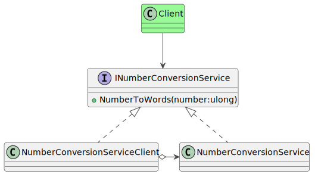

### Intent

The intent of this pattern is to substitute an object with a placeholder for any reason, such as to transform the input or output or to provide an alternative representation of the original. This pattern is similar in intent to the adapter pattern. But an adapter changes the interface to suit the client's needs, whereas a proxy mirrors the interface of its underlying object.

### Problem

This example uses the SOAP client services tools that ship as a part of .NET. SOAP messages are encoded as XML and can be transmitted over any transport, such as HTTP or SMTP. But parsing XML gets tedious and is prone to errors. And SOAP itself is a gargantuan pile of specifications that few people understand. That's why vendors sell tooling to generate language-specific bindings that abstract away the XML documents behind types and methods that mirror the web API. As a result, programmers can consume the service by writing statically-typed imperative methods.

This example uses the Number Conversion Service available at the link below.

https://www.dataaccess.com/webservicesserver/numberconversion.wso?WSDL

This service exposes an operation called `NumberToWords`, that takes an instance of `NumberToWordsSoapRequest` as a parameter and returns a `NumberToWordsSoapResponse`. The request object has a Body property of type `NumberToWordsRequestBody`, which in turn encapsulates an unsigned integer that holds the number to be converted. The operation responds with the type `NumberToWordsResponse`, containing the string that denotes the value of the number in words.



### Solution

This entire hierarchy is easily represented in classes that the wsdl.exe utility can generate automatically. The client consumes this API using C# language statements without having to directly interact with the service, XML or network protocols.

```csharp
try
{
  var client = new NumberConversionSoapTypeClient();
  var response = await client.NumberToWordsAsync(100); // Returns the string "one hundred"
}
catch (Exception)
{
  // Handle the exception.
}
```

If you were to inspect the contents of the `NumberConversionSoapTypeClient`, you would see that it has a corresponding method for each operation that is described in the WSDL document for the service.

```csharp
public class NumberConversionSoapTypeClient
{
  ...
  public Task<NumberToWordsResponse> NumberToWordsAsync(ulong ubiNum)
  {
    NumberToWordsRequest inValue = new NumberToWordsRequest();
    inValue.Body = new NumberToWordsRequestBody();
    inValue.Body.ubiNum = ubiNum;
    return ((NumberConversionSoapType(this)).NumberToWordsAsync(inValue);
  }
  ...
}
```

The framework itself provides a general purpose implementation of the method that invokes the API over the network, awaits its response, deserializes its contents into class instances and throws an exception in case an error occurs.

The proxy has a 1:1 parity with the methods, and the request and response types that the service exposes.
