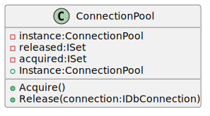

### Intent

The Singleton pattern is one of the simplest and most commonly used in practice. Its purpose is to restrict a class to only one instance throughout the lifetime of the application. This is desirable in cases when there is one or only a few resources available and access has to be controlled.

### Problem

A common use case is resource pools to objects which are expensive to acquire. Some examples are a database connection pool or a local cache of the results of a network operation. The object pool itself is a design pattern worthy of its own detailed discussion. In this article, however, I will limit myself to describing its implementation as a singleton.

The source code for this design pattern, and all the others, can be viewed in the [Practical Design Patterns](https://github.com/pranavnegandhi/PracticalDesignPatterns) repository.

### Solution

This pattern has multiple possible implementations in C#. The ones shown below are built purely on the language features. There are still other ways of limiting a class to single instance through the use of dependency injection frameworks. Those techniques are not covered here.



#### Single-threaded, Lazy Initialisation

The first example is the simplest possible implementation of this pattern. This version is not thread-safe, but can use lazy initialisation in a single-threaded scenario. If there are multiple threads attempting to invoke the Instance property of this class, many or all of them will cause an invocation of the constructor. In this case, it has to be eagerly initialised.

```csharp
public sealed class ConnectionPool
{
    private static ConnectionPool _instance;

    private ISet<IDbConnection> _released;

    private ISet<IDbConnection> _acquired;

    private ConnectionPool()
    {
        // Initialise the collection objects
    }

    public IDbConnection Acquire()
    {
        // Retrieve a free connection instance
        // Instantiate a new one if there are no free instances
        // Move the connection instance into the acquired collection
    }

    public void Release(IDbConnection connection)
    {
        // Remove the connection from the acquired collection
        // Add it into the released collection
    }

    public static ConnectionPool Instance
    {
        get
        {
            if (null == _instance)
            {
                _instance = new ConnectionPool();
            }

            return _instance;
        }
    }
}
```

This could be an acceptable solution for simple situations where multiple threads are not involved. But with multi-threaded applications being more or less the norm in a language like C#, the actual number of situations where this code will be safe to use are very limited. This is truer than ever before with the advent of opaque multi-threading as supported by TPL. In my experience, it is safer to err on the side of caution and not use this implementation in production.

In multi-threaded situations, the risk of invoking the constructor multiple times can be mitigated by calling the Instance property immediately on startup before launching any additional threads, i.e. by using eager initialisation. But the cost of eager initialisation and high risk of introducing synchronisation bugs in the future makes it an unattractive option.

If you need thread-safety in your singleton, you need a different solution. The simplest way is to use a lock.

#### Multi-threaded, Lazy Initialisation

```csharp
public sealed class ConnectionPool
{
    private static ConnectionPool _instance;

    ...

    private readonly object padlock = new { };

    private ConnectionPool()
    {
        // Initialise the collection objects
    }

    public IDbConnection Acquire()
    {
        ...
    }

    public void Release(IDbConnection connection)
    {
        ...
    }

    public static ConnectionPool Instance
    {
        get
        {
            lock (padlock)
            {
                if (null == _instance)
                {
                    _instance = new ConnectionPool();
                }

                return _instance;
            }
        }
    }
}
```

The drawback to this technique is that every invocation of Instance has to acquire a lock. This is an unnecessary performance hit after an instance has been created once, because the property does not modify the instance ever afterwards.

Again, this is not incorrect. The code will perform exactly according to the pattern specification, and can be used if bleeding-edge performance is not an absolute must-have or the instance is not being referenced frequently. In practice, locking impacts performance by a single-digit percentage.

#### Lock-free, Multi-threaded, Lazy Initialisation

But faster it can get. The advantages of ease in maintaining and reasoning about lock-free code are a bonus.

```csharp
public class ConnectionPool
{
    private static readonly ConnectionPool _instance = new ConnectionPool();

    static ConnectionPool()
    {
    }

    private ConnectionPool()
    {
    }

    public IDbConnection Acquire()
    {
        ...
    }

    public void Release(IDbConnection connection)
    {
        ...
    }

    public static ConnectionPool Instance
    {
        get
        {
            return _instance;
        }
    }
}
```

The above example contains a static constructor along with the regular instance constructor. The static constructor itself does not require any code. But as a side-effect of its presence in the code, the type initialiser method of this class is only executed when a static or instance field is accessed for the first time, or when a static, instance or virtual method of the type is invoked for the first time.

This is a by-product of the language design and [described in detail by Jon Skeet on his website](http://www.csharpindepth.com/articles/BeforeFieldInit). The runtime runs this check before creating a new type, and guarantees that this executes only once. This implementation leverages this behaviour to constrain the class instantiation to just once, only when the Instance property of the class is invoked for the first time.
