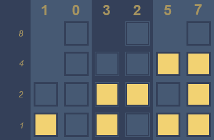
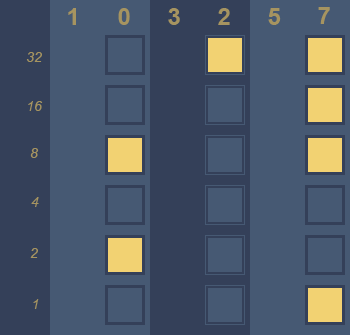

Binary clocks are probably one of the epitomes of geek cred. Everybody can read an analog or digital clock that represents numbers in base 10. But it takes a geek to read the time from a gadget that uses an obscure and cryptic number system. Call it the hipsterdom of technology.

### Understanding Number Systems

Modern number systems are remarkably similar to each other conceptually. The only difference is their applicability in different scenarios. The decimal system is in common use every day all over the world. Many fundamental concepts that are carried forward into other systems were refined using base 10 numerals. The most essential of these are naming unique digits, and positional notation.

#### Unique Digits

Numbers are a strange beast in that they have no end. The most primitive counting systems used scratches in the dust or pebbles to keep count. It became easier to represent larger values with the advent of separate symbols to identify different numbers. Roman numerals had special symbols for many numbers such as 5 (V), 10 (X) and 50 (L). While this made representation of larger values more compact, it still wasn't perfect. It took the Indians, and later the Arabs, to finally come up with an extensible, yet concise number system that could represent any imaginable value.

Since it is impossible to have unique representations for every number when they are essentially infinite, the Hindu-Arabic numeral system instead has 10 unique symbols in base 10 to represent the digits from 0 to 9. By applying positional notation, all possible numerals can be represented by using these 10 symbols. Numbers greater than 9 are represented by stringing digits together. The leftmost digit has a greater magnitude than the one to its right, and the value of the numeral is a sum of its digits multiplied by their magnitudes.

#### Positional Notation

The magnitude itself is a power of the base. In the decimal system, the base is 10. Hence, the magnitude is 10 raised to a power that increases by one for every leftward shift. The rightmost number is multiplied by the 0th power of 10 and represents the ones position. The position to its immediate left is multiplied by 10 raised to 1, the next by 10 raised to 2, and so on.

Let us take the numeral 256 to illustrate this.

```
256 = 2 × 10² + 5 × 10¹ + 6 × 10⁰
    = 2 × 100 + 5 × 10 + 6 × 1
    = 200 + 50 + 6
    = 256
```

Binary uses the same concept to represent values. The only difference is that the rollover value in binary is 1 since it has only two digits - 0 and 1, and the number is multiplied by a power of 2 instead of a power of 10. It is also more verbose than the decimal number system. Even a relatively small value like 25 requires 5 digits in binary - 11001.

```
11001 = 1 × 2⁴ + 1 × 2³ + 0 × 2² + 0 × 2¹ + 1 × 2⁰
      = 1 × 16 + 1 × 8 + 0 × 4 + 0 × 2 + 1 × 1
      = 16 + 8 + 0 + 0 + 1
      = 25
```

In this sense, number systems are identical to odometers. When the rightmost digit reaches a certain maximum value, it goes down back to zero and the digit to its immediate left increases by one. If the second column is also at the largest digit, then it too resets to zero and the increment is applied to the third column.

Being able to read binary representations is obviously an essential requirement to read the time in a binary clock.

### Structure of a Binary Clock Face

There are two types of binary clocks possible - ones that use binary coded decimals, and true binary clocks.

<figure>
  
  <figcaption>A clock face that uses binary-coded decimal notation</figcaption>
</figure>

A BCD clock face is divided into six columns - two for each component of the time. Each column contains up to four rows, one for each power of two. The leftmost two columns represent the hour, the middle two are minute columns and the last two represent seconds. Each column represents a single base 10 digit of time. For example, if the value of column one is 1 and that of column 2 is 0, then the clock is representing the 10th hour of the day, or after 10 am. Similarly, if the value in column three and four is 3 and 2 respectively, the clock is in the 32nd minute of the current hour.

<figure>
  
  <figcaption>A clock face that represents time components in pure binary notation</figcaption>
</figure>

True binary clocks represent each time component in a single column. Such clocks require only three columns, and up to six rows in each column to adequately cover all required values. Each column represents the absolute value of the component in binary encoding. For example, 0b001010 in the hour column represents 10 (1 × 2³ + 1 × 2¹). 0b100000 in the minutes column represents the 32nd minute of the hour. Together, the two values indicate the time as 10:32 am.

Even if you are not very accomplished at converting from binary to decimal easily, there are only a few values required to display the time in binary. Most people can easily memorize the light sequences and the values they represent after a few days of practicing.
