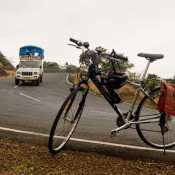
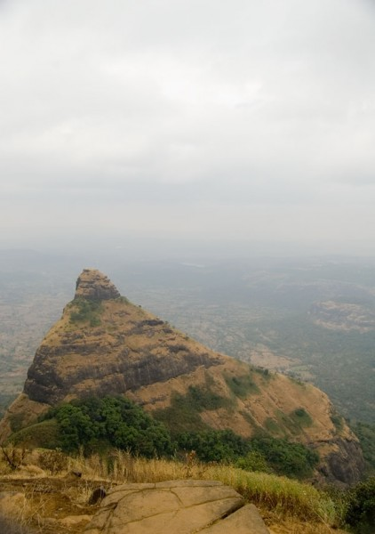
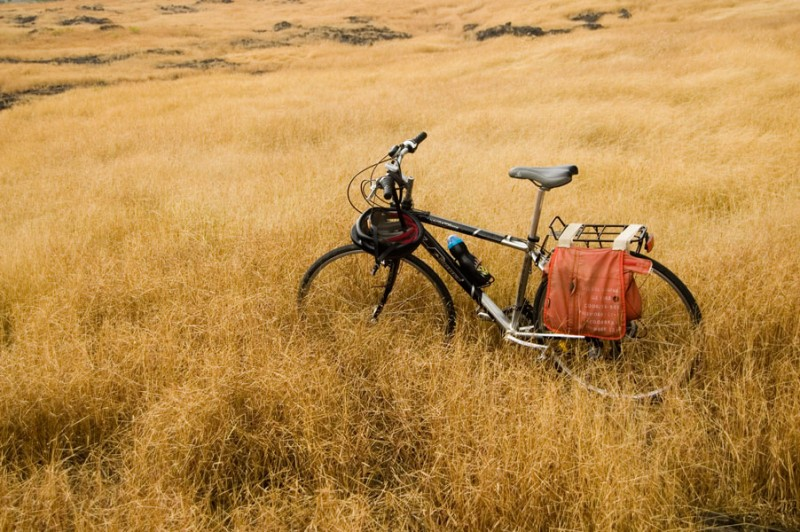

### Early Morning

Being inspired by Sudipto’s ride last Sunday, I had planned my own trip down to Lonavala on Thursday. The plan had to be shelved because we were up till late on Wednesday night following the situation in Mumbai. But I had an itch and it needed scratching. So I realigned my plans for Saturday.

The original idea was to leave early by 5:30 in the morning. Lonavala is just a couple of hours ride from here, so I could be there by early morning, have breakfast and return by around lunchtime. But I overslept instead, and it was 7:00 by the time I was ready to leave. Being late however turned out to be good for me. It had been raining earlier in the morning and riding through the cold rain wouldn’t have been a very pleasant experience.

I donned a jacket to keep out the cold and took off. It was well past daybreak and there was no need for additional lights on the bike. The dynamo on my bike had anyway been damaged earlier and I was not very keen on wasting time attaching the lights from my wife’s bike onto my own. I could feel the nip in the air even as I carried the bike downstairs. The cold air struck my bare legs as I began to ride. Winter’s here, I thought to myself.

Climbing up to Lion's Point

The journey up to Lonavala itself was rather uneventful. I clipped along at a steady 20 km/h and stopped for a bite every hour. It was yet quite cold and the warm missal-pao at 8:30 am provided welcome relief. I was just beyond Vadgaon and just a few kilometres away from Kamshet Ghat. During my previous trips to Lonavala on the Exodus, I had been unable to ride up this incline and had to resort to pushing the bike up. But I was confident that the Navigator would change the equation entirely.

And I wasn’t disappointed. Even more fun was the long slope at the other side of the hump. A light road bike really is a pleasure to ride in such conditions.

### Reaching Lonavala

Once past Kamshet, the road turns into a very gentle incline towards Lonavala. This had to be the easiest ten kilometres of the trip. A strong crosswind blew from the right, but didn’t hamper progress much. It was chilly and overcast though and there wasn’t even a glimpse of the sun even though it was past 9:00 am. I left the jacket on.

I reached Lonavala exactly at 10:00 in the morning. The odometer read 60 kilometres. The main market of Lonavala had already gone by and I was on the road leading to Bhushi Dam. There was no planned destination in my mind and it seemed quite silly now to just cross the market and come back. This wasn’t exactly a shopping trip.

I munched upon a few biscuits while ruminating upon my further plan of action. Curious passers-by stared or waved at me while I waited at the corner. There were few tourists on this road and the ones who did pass by in their cars cheered or waved past. Hunger satiated, I mounted the bike again and began to ride towards Bhushi Dam. The dam itself is a little off the road and attracts many visitors during the monsoons when it overflows. But this was off-season and it would probably be dry. No other vehicles passed me by till I reached the village near the dam.

### Destination – Lions Point

View from the top

Since I had no interest in stopping at Bhushi Dam, I continued to ride further on. There were two navy and air-force installations further down the road so I was expecting some sort of end-of-the-road sign ahead. Surprisingly, no such thing happened. The road branched off towards the navy base a little further, leaving me with more roads to explore. And signs began to welcome me to Amby Valley.

I now had a new destination in mind.

However, a huge climb lay between the valley and me. Cars and motorbikes zoomed past at several kilometres an hour while I crept along in single digit speeds. I stopped several times to catch my breath before finally giving up and began pushing the bike up till I reached the air-force station at the top of the hill. Once there, I mounted again and began to enjoy the relatively flatter terrain. At one point I noticed a sign indicating a spot called Lion’s Point. I dropped the idea of going all the way into the valley again at the other side and having to face another treacherous climb on the way back and instead aimed to turn back at this spot.

I rolled into a flat open space by the roadside just as the odometer touched 70 kilometres. “Lions Point” – the sign read. The wind was blowing wildly. It was a steep drop from the edge of the cliff. My bicycle and backpack had to be held down to prevent them from taking a leaping dive down. I pushed the bike a little away from the edge behind a locked down handcart and tied it there. I then set off to explore the views and take some pictures of the breathtaking surroundings.

There was nothing to hear except the whistling of the winds. Even the chirping of the birds was drowned in this sound. Then all of sudden the wind died down I was startled by a whining sound behind me which turned out to be a dog, probably expecting a treat. But it was scared away when I jumped 3 feet up in the air in surprise.

Jeez.

### The Return Journey

I picked up my bag and camera and headed back to the bike. It was nearing 1 in the afternoon and I was dying for a bite. The ride down was fascinating and I zipped down in a few minutes. A motorcycle rider headed in the opposite direction was taken aback when he saw me coming down a curve and hollered out. Some of the locals from Bhushi village gathered to wave out from the sides of the road. One of the kids coming from the opposite direction on a bicycle shouted gleefully, “Racing! Racing! Good luck.” I smiled and waved back.

Twenty minutes later I was back in Lonavala market, tucking into a meal.

At 2 pm, I began the ride back to Pune. I was now faced with a double whammy – the gentle incline in the road till Kamshet meant I was going to be riding upwards for most of this road. To make things difficult, the crosswinds had changed direction and were now coming on at me from the full-front. My speed dropped down to between 10-12 kilometres an hour and I had to stop for a break every half an hour or so. I was beginning to fear what effort the Kamshet climb would entail.

Surprisingly, the winds died down during the uphill at the ghat, but came back double quick on the other side of the hump. The lull in the headwinds had probably been because the mountain itself shielded me from them. I had to stop pedalling on the other side and focus only on keeping the bike straight, such was the force of the winds.

Conditions remained like this for practically the rest of the way up to Bhakti-Shakti Chowk at Nigdi – a full 50 kilometres from the outskirts of Lonavala. The highway was now packed with traffic and motorcycle riders would pass by slowly wondering what kind of crazy creature had been let loose here. Some waved. I finally gave up riding at the outskirts of Nigdi – about a kilometre before the Bhakti-Shakti Chowk and began pushing the bike through the dirt at the side of the road. Not only was I tired, but the two-lane road was getting filled with agitated drivers racing against each other. Several times I saw cars from the opposite side coming into my lane and heading towards me at breathtaking speeds, turning back into their lanes just metres ahead of me.

Once back on a real road, I took upon the bike again with gusto. The buildings surrounding me broke the winds finally and I was able to pick up a decent pace again. It was 15 kilometres from here to home.

I covered the rest of the distance in an hour, mainly slowing down near Kasarwadi due to traffic.

It was 6 by the time I reached home – 11 hours since I left. The odometer read 141 kilometres.
