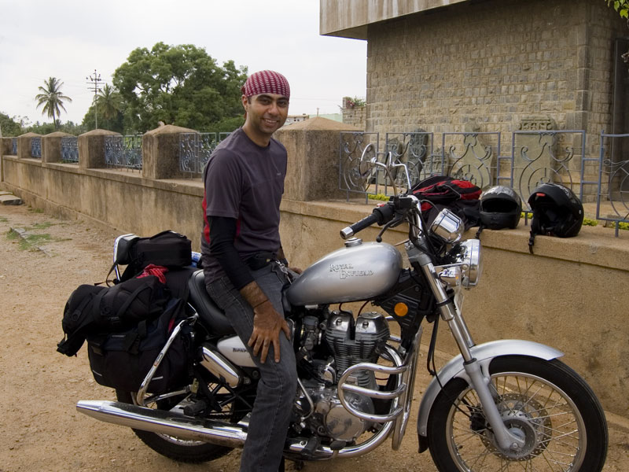
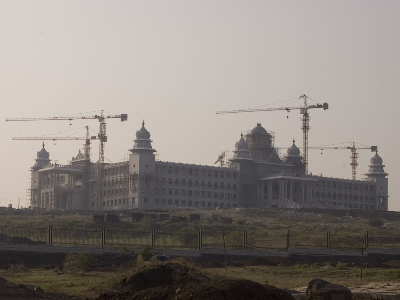
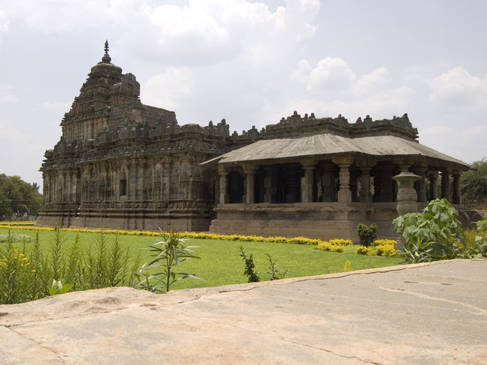
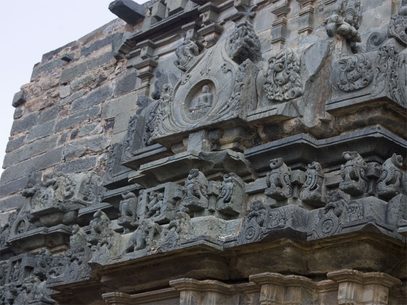
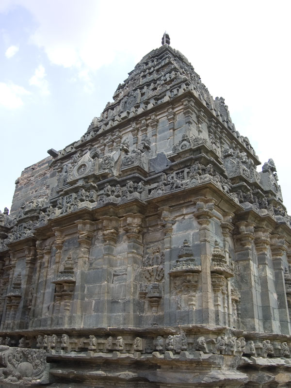
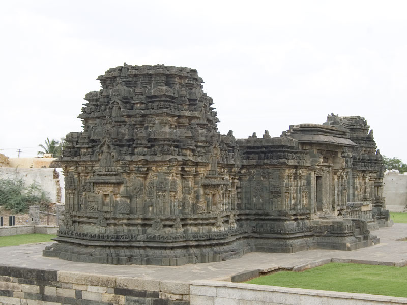
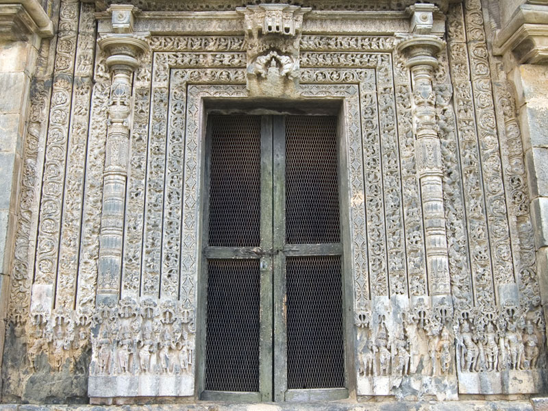
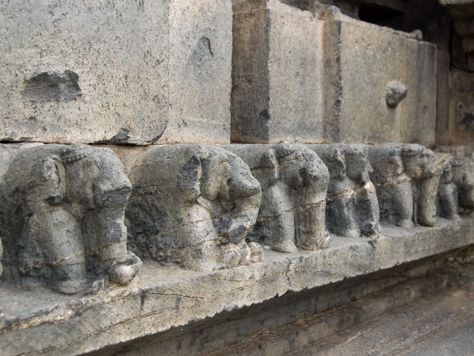
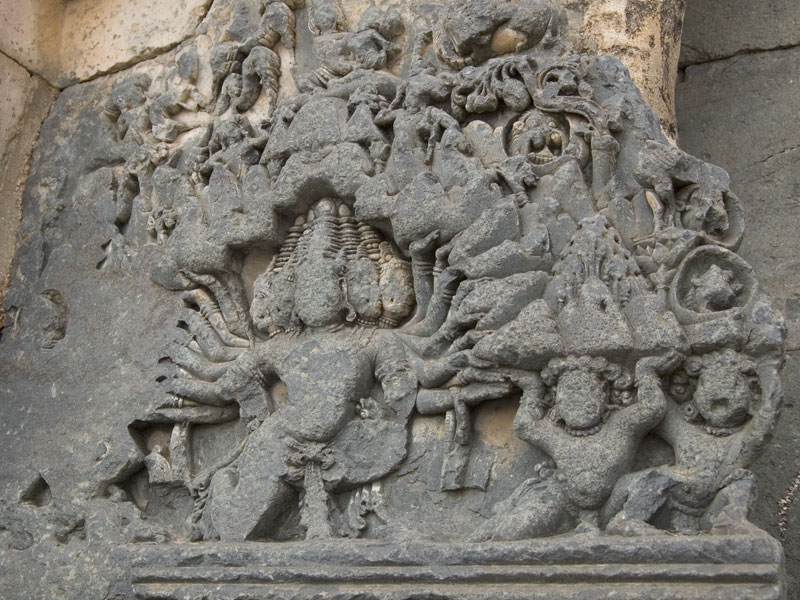
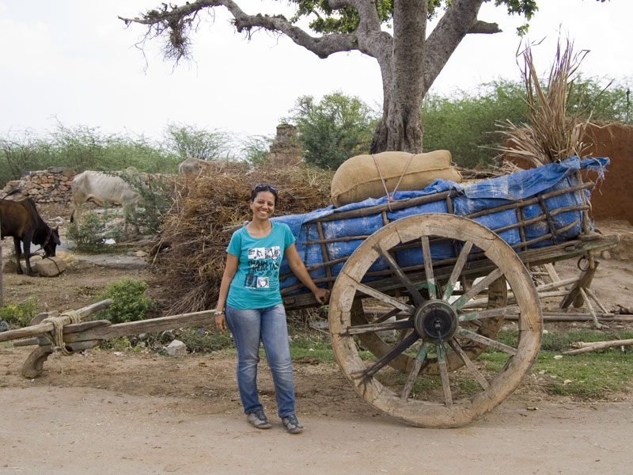

<figure>
  
  <figcaption>Outside the ASI museum at Lakkundi. Fully loaded, ready to ride.</figcaption>
</figure>

Hampi itself is a small village without significant facilities. Most tourist guides recommend staying at Hospet instead, which is about 13 kilometres away, and as an industrial city, offers a significantly improved urban infrastructure than Hampi. Both places fall in the Bellary district of Karnataka state. It lies about 250 kilometres from Belgaum.

<figure>
  
  <figcaption>A closer look at the Belgaum Vidhan Soudha building under construction</figcaption>
</figure>

We left at around 7 am from Belgaum, later by an hour than planned. We were still quite tired and had to yet catch up with sleep. Good roads with little traffic and wind, meant we were able to reach Hubli (100 kilometres) by 9 am. Our original plan consisted of stopping at Kittur to see the fort there. But we had poor reviews from Anvith about the condition of the fort, because of which we preferred to take our chances with the temples at Lakkundi instead. This was a choice we wouldn't regret.

The road to Hospet diverges from the Bangalore highway after Hubli. Surface conditions are significantly worse on SH 67 than the national highway, along with narrower roads. But sparse traffic and plenty of tree cover to break the wind allowed for good speeds. The only drawback was the complete absence of traveller facilities – food and toilets were both conspicuously absent. By the time we reached Gadag, we were starving and completely drained. I was hoping to find at least a decent restaurant in Gadag, the last major town till Hospet. But nothing worthwhile turned up there either. A lonely dhaba a few kilometres after Gadag turned out to be our last option. The kitchen did not offer anything substantial other than rice, which was palatable, but only barely. It did provide enough sustenance to last until Hospet, at least, which was much more than one could ask out there.

<figure>
  
  <figcaption>Exteriors of the Brahma Jinalaya Temple</figcaption>
</figure>

<figure>
  
  <figcaption>Close-up of the shikhara details at the Brahma Jinalaya</figcaption>
</figure>

The kilometres began to melt again until Lakkundi.

#### Lakkundi – Big Things in a Small Package

Most people we spoke to had never heard of Lakkundi, a tiny village between Gadag and Hospet. Archeological resources point out as many as 50 temples, 100 stepped wells and several inscriptions of various vintages within its vicinity. Its insignificant size belies the archeological and cultural significance it holds. Chalukyas and Hoysalas once held this village as part of their empire.

The [Kasivisvesvara Temple at Lakkundi](http://en.wikipedia.org/wiki/Kasivisvesvara_temple,_Lakkundi) is considered a pinnacle of the Kalyani Chalukya architectural style. It is an important link between the early Chalukya style, seen at Badami, and Hoysala architecture who immediately followed the Chalukya empire. One is easily captured right at the doorway itself, by the elaborate nine-layered mouldings of the doorway frame and an intricate carving in relief of Gajalakshmi. Opposite to the main entrace lies a shrine to Surya, the Sun god.

<figure>
  
  <figcaption>The quality of detail and finish in the Lakkundi temples is significantly greater than the ones at Badami. Due credit should go to the improved skill of the artisans and the better material to work with.</figcaption>
</figure>

The [Brahma Jinalaya](http://www.karnataka.com/gadag/lakkundi-brahma-jinalaya/) is an interesting temple which was originally consecerated as a [Jain basadi](http://www.harekrsna.com/sun/features/08-09/features1472.htm) by queen Attimabe, wife of a local chieftain called Nagadeva. It is built out of chloric schist, which is more workable for detailed carvings compared to sandstone which was otherwise popular in this region. The difference in intricacy and finishing is noticeable.

According to the description board put up by the ASI outside, the temple was once used to worship a larger idol of an unknown tirthankara. Its name probably originates from either the Brahma idol inside the sanctum, or from the approval the temple received from the Brahmanas of Lokkigundi.

<figure>
  
  <figcaption>Shikhara at the Brahma Jinalaya</figcaption>
</figure>

The last site that we had time to visit at Lakkundi was the Nanneswara Temple, just opposite the Kasivisvesvara Temple. It is believed to have been built as a prototype to the much more elaborately detailed Kasivisvesvara Temple.

#### To Hospet!

We spent a good two hours in just these three sites at Lakkundi. If you have time, guide books recommend visiting the Manikeshwara Temple and stepped tank here. Since it was past 3 pm, we preferred to give these two a pass and move onwards. The road continued to remain mostly featureless other than vast open plains and fields until we reached Koppal and Ginigera. The landscape suddenly was strewn with large boulders, a sign that we were nearing Hospet and Hampi.

<figure>
  
  <figcaption>Kasivisvesvara Temple – what a tongue twister...</figcaption>
</figure>

The road is currently being rebuilt from the junction of SH 67 and NH 13 all the way up to Hospet, which caused a lot of trouble. The dust and uneven surface are the least of worries. One also has to deal with rash driving between laden construction vehicles and frequent detours. To make matters worse, repairs were also ongoing at College Road, a major thoroughfare in the city of Hospet. In all, the last 20 kilometres took us close to an hour to cover. After a week of honing my handling skills on bad roads, I think I might be able to do it much faster.

<figure>
  
  <figcaption>Decorative door panels, assembled from nine layers of intricate carvings</figcaption>
</figure>

<figure>
  
  <figcaption>Rows of elephants, horses and mythical creatures surround the plinth of the temple</figcaption>
</figure>

At Hospet, we were stopped by local traffic police. The officer demanded my license, which was in postal transit from the Maharashtra RTO office at the time of leaving from Pune. I had a reciept in lieu of the licence, which pissed off the officer. He demanded to see the rest of the vehicle documentation, which I promptly presented for inspection. He still seemed to have a grudge about the missing license, but quickly backed out when I offered to call the Maharashtra RTO office to clarify the matter. As suggested by forum members from Bike Nomads, the key is confidence. Having everything else in order also helps. The fear of having to deal with inter-state bureaucracy also probably a big deterrent.

<figure>
  
  <figcaption>Ravana lifting Mount Kailash, the adobe of Shiva</figcaption>
</figure>

Finding Hotel Karthik was a bit of a problem due to the construction activity on College Road and late hour. And the rooms and food were a bit of a disappointment. Having nothing better to do, we turned in early.

Ami strikes a pose outside with a bullock cart
