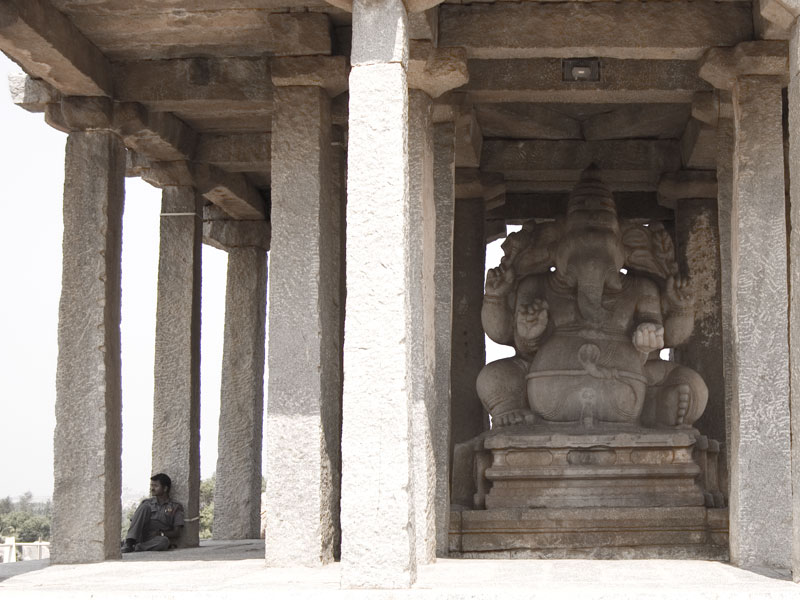
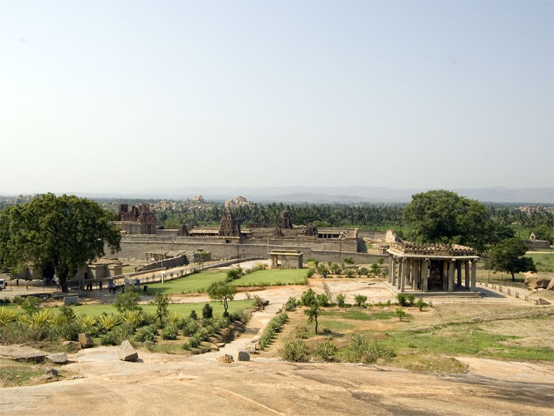
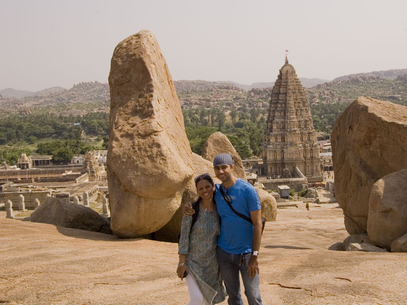
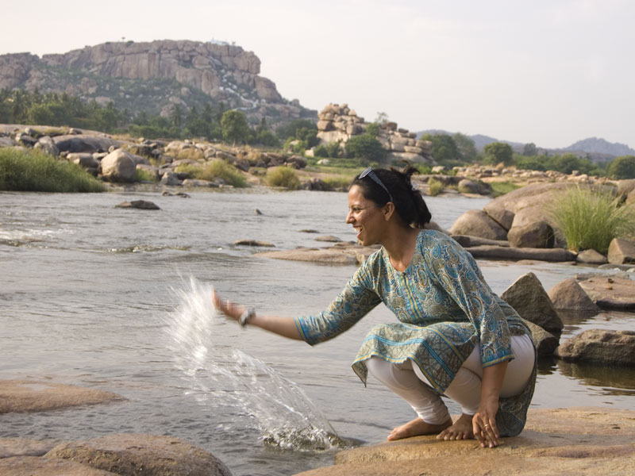
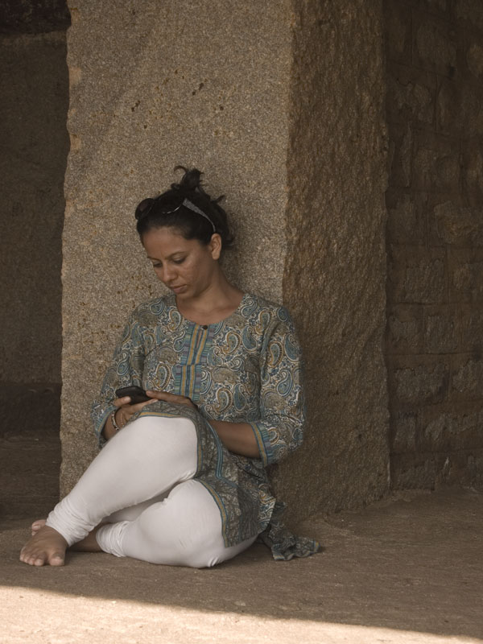
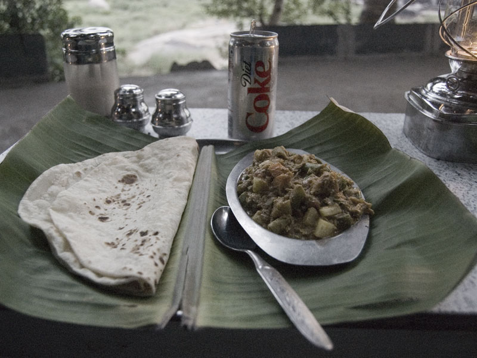

<figure>
  
  <figcaption>Tours begin under the auspices of Sasivelaku Ganesh</figcaption>
</figure>

At Belgaum, Anvith had mentioned of people having made several visits to Hampi and still discovering something new and interesting to see. The ruins of the old Vijayanagara capital are spread over such a large expanse, that it is impossible to see everything and do it justice in a two-day trip. With settlements dating back to 2000 years ago being found here, this is not surprising at all. The Ramayana too has mentions of Kishkindha, the mythological capital of the monkey kings Vali and Sugriva, and Matanga Hill, both of which are located here. Anjanagiri Hill nearby is supposed to have been the birthplace of Hanuman.

<figure>
  
  <figcaption>View of the Krishna Temple and Ganesh Temple from the top of Hemakuta Hill</figcaption>
</figure>

Being on our first trip here, we decided to not expect much by way of sense or structure, and just take things as they come. We hired a guide near the Sasivekalu Ganesh Temple for Rs. 600 for half a day. In hindsight, this was very, very steep, especially considering that April to September is the off season. You're better off going all the way up to the tourist information office near the Virupaksha Temple ahead and hiring a guide from there. Do carry a map with you, else buy a cheap guide book (Rs. 20) from the local vendors. They also sell a more expensive (Rs. 100) guide book, purportedly published by the ASI, with much better print quality and colour photographs. But this book has no local map of the ruins themselves. I found this rather pointless since all monuments already have detailed write-ups put up on the sign boards outside. It is recommended to either carry your own map with the points of interest marked, or to buy the cheaper book with the map.

<figure>
  
  <figcaption>With the Virupaksha Temple in the distance</figcaption>
</figure>

The guides break up the place into two major sections – the religious sites and the royal monuments. Religious sites consist of the Hemakuta Hill, Virupaksha Temple, Hampi Bazar, Matanga Hill, Kodanda Rama Temple, Achyutraya Temple and several other smaller sites, culminating at the [Vittala Temple](http://hampi.in/vittala-temple). If you're up for a boat ride, a coracle can take you across the Tungabhadra River to see the Hanuman Temple on Anjanagiri Hill. I declined because of my general dislike for travelling on any surface other than solid ground. Quotes began at Rs. 150 per person, and can go substantially lower depending on your bargaining skills. Make brazen and shameless counter offers.

<figure>
  
  <figcaption>Living it off on the banks of the Tungabhadra. The Anjanagiri Mountain can be seen in the distance.</figcaption>
</figure>

The royal enclosure falls on the other side of the main approach road to Hampi. This consists of the Krishna Temple, the underground Shiva Temple, Hazara Rama Temple, the Zenana, elephant stables and several other smaller sites. This route also ends at the Vittala Temple, which is pretty much the best preserved of the entire lot of monuments in Hampi. We visited the religious centre on our first day here, covering the entire portion up to the Vittala Temple by foot with the guide.

The convenience of having your own vehicle, especially a small fuel-powered moped or motorcycle, is unmatched. We saw seweral foreign tourists on rental mopeds. Indian visitors generally have their own vehicles or rent autorickshaws. Some walk. I did not see any obviously touristy-looking Indians on rental mopeds, although they are very common with the locals. Cars are fine, but they cannot go into narrow tracks which are common in the religious centre. If you don't mind riding in the heat, you can rent a bicycle. We only saw one tourist on a rental bicycle in Hampi for this reason. Autorickshaws are also available if you prefer, but they are expensive. In any case, expect to do a lot of walking. Even with a motor vehicle to travel between different sites, most of the palaces and temple complexes are very large from within. On our first day, we walked from Hemakuta Hill all the way up to the Vittala Temple, back to Hampi Bazar for lunch in the afternoon, and then back again to Vittala Temple to take photographs in the mellow evening light. Then we walked back to the parking lot near Sasivekalu Ganesh Temple, which added up to at least 8-10 kilometres in all.

<figure>
  
  <figcaption>Whiling away the hot afternoon at the Purandara Dasa Mandapa</figcaption>
</figure>

#### Under the Mango Tree

Food was a big problem the evening before at Hospet. Even at Hampi, lunch was average at best. The evening meal suddenly became much better, due to the chance mention of our guide of a restaurant called Mango Tree. Situated off the main access road, you can see a sign board to the restaurant at a junction half a kilometre from the Sasivekalu Ganesh Temple parking lot. Watch out for a large arch on the right hand side as you ride on your way back. Turn right here and pass through a small village until you reach the end of the road. A downhill slope on the right over paved stones takes you to what seemed like a gated private estate or farm. Cars must be parked outside the gate, but a smaller gate at the side lets bikes inside. Park near the gate and walk a short distance through banana plantations to the restaurant. Built on the banks of the river, the stepped terraces make for a very pleasant and private seating area. While they do serve continental food, their spicy local delicacies are to die for. Especially high on the list are the coconut curry and a variety of “parotas“ – a house specialty pie with different types of stuffing such as potatoes, cheese or fruit.

<figure>
  
  <figcaption>Everything tastes better with a Diet Coke</figcaption>
</figure>

The ride back to Hospet was uneventful. The convenience of having a motorcycle was especially evident again, as we rode through the dark night. Had we been in an autorickshaw or hampered by bus schedules, the evening would have been on a much tighter leash.
