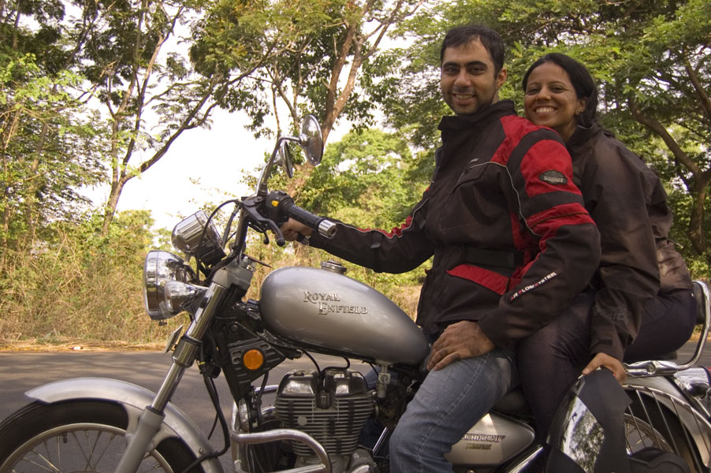

Every trip I've ever undertaken has been formulated around the idea of making the journey the destination. It is the most natural way to travel. Why anybody would want to miss out on the sights between the origin and destination of a journey is beyond me, especially when you consider that a typical vacation requires a significant amount of time to be spent in travelling. But this adage has never rung truer for me than on this tour, where I would be spending many hours of the day at the helm, directing the entire journey.

You, me and Anna, en route to Nandgad – photo credits Anvith K. S.

This was a significant milestone for me in many ways. It was my first time travelling long distances in a vehicle of my own over many days. I have done a few trips to nearby destinations, spanning at most a day or so on my bikes before. But nothing ever came close to this one. Being the first person in the family with a personal vehicle in three generations meant there was no resource of childhood road trip experiences to draw from. It was just me planning my own trip, finding my own way and correcting mistakes as they were made.

Finally, motorcycle touring has been on my radar for the longest amount of time. For those who already ride bikes, this needs no explanation. For those who don't or are afraid of bikes, the best way to understand the feeling is to mount saddle and hit the road. This is a pure form of travel which really makes the journey come alive. The destination ceases to be a goal as you soak in the experiences along the way. While I have never driven a car, my negligible experience of travelling as a passenger in one was, to put it mildly, meh. I would much rather brave the elements and the dust than travel in antiseptic insulation from the worst that nature can unleash. In my opinion, if you do not reach your destination dusty and soaked in sweat, you're doing it wrong.
