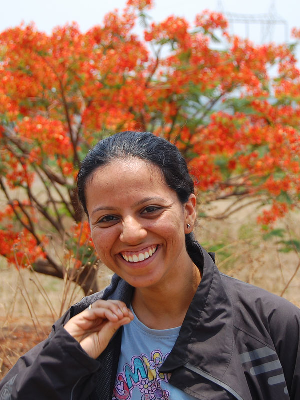
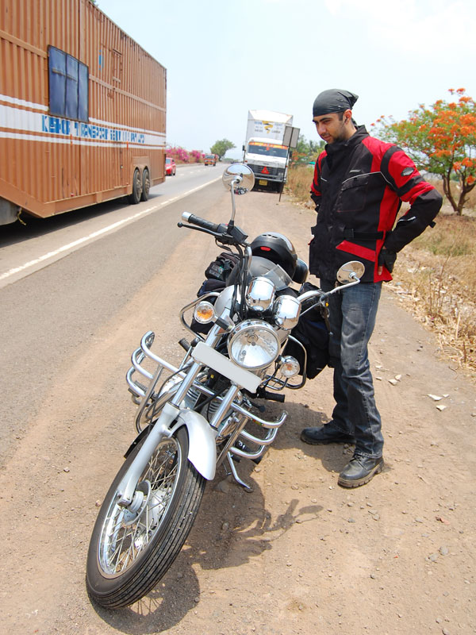
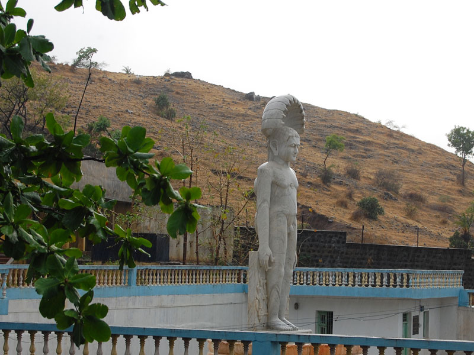
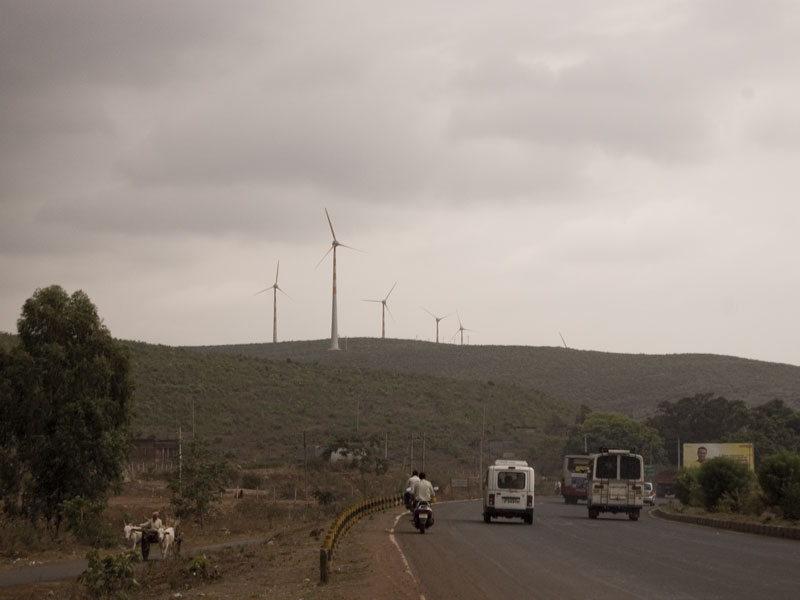

The night before we were to leave turned out to last longer than I had anticipated, in spite of my best efforts to get things done on time. Work and packing were taking a toll on my already stretched nerves. Which is why when I finally hit the sack at 1 am, I knew there was no way I'd be getting up on time again to ride out at 6. Being delayed turned out to be a trend through the rest of the journey, one which I would like to avoid in future trips. Morning hours are the best to ride in. Once past 11 am in peak summer, the heat takes a significant toll on strength and sanity.

<figure>
  
  <figcaption>Bright smiles along the way</figcaption>
</figure>

We both staggered out of bed at 7 and stepped out of the house close to two hours later. Strapping down the luggage took a few more minutes before we were out on our greatest adventure yet. It was 8:45 am. We had missed the best time to travel during the day. At this point, I was only interested in reaching Belgaum safe before nightfall.

Being close to peak hours, the traffic had already become thick throughout Pune city limits, in spite of us being on the highway. It thinned out a bit around Katraj flyover and Jhambulwadi lake, before returning with a vengeance after Nasrapur. An accident between a car and a truck around Kapurhol made things worse. The heat was getting to me and I had given up all hope of ever shifting out of the Thunderbird's ever versatile gear 3. We too became unwilling participants in a minor bump and graze when some nut on a bike hit us from behind at a toll booth.

After Shirwal, traffic began to thin out again up to the Khambatki ghat climb. There too, most of the traffic was caused by a single multi-axle truck climbing up hill on the narrow incline. Typical of this hour, many cagers were eager to get past the big vehicle and took a lot of needless risks in the process like driving into the rough and boulder-strewn shoulder. Being hesitant to take risks that could result in us turning into road pizza so early in the journey, I took the safer option to trail at a safe distance until cleared to pass by the driver. Roads became empty again until the end of the ghat at the other side. Thankfully most of the cagers turned off at the Surur junction towards Panchgani and Mahabaleshwar.

<figure>
  
  <figcaption>Weighing the risks of getting killed while riding through district Kolhapur</figcaption>
</figure>

We would soon be entering Kolhapur district, which possibly has the worst ratio of dickbag drivers to rational ones in all the destinations we covered through this trip. Even the famed maniac bus drivers from Karnataka would turn white in the face of a white SUV bearing a registration plate with numbers MH-09 searing down towards them. The only physics applicable in district Kolhapur is horse-power. Friction, trajectories and solid body collisions needn't be taught in schools, because they don't work here any more (until a collision actually occurs, that is). And what's with the obsession with white cars?

The road was mostly clear through the next few towns all the way till a petrol pump 30 kms out of Kolhapur. Roads were good enough to let Anna effortlessly pull along at 80. We stopped for lunch and cool off from the heat for a bit here. The worst of the heat was on the wane at around 2:00 pm. But the relief of food and jugs of water was very welcome. We hit the road an hour later, hoping to wing it to Belgaum by 5 pm.

Past Kolhapur, the landscape gave way to much more open spaces and fewer trees and structures to break the wind. Very strong crosswinds slowed us down to speeds of 50 kilometres an hour. The going was tough, but I persisted. This trip was a very important lesson for me in bike handling skills in varied conditions. And my education had begun with a really difficult course. It took an hour to get past the border of Maharashtra and Karnataka into Nipani. The landscape was still open, but the quality of the roads changed dramatically. Whatever problems Karnataka might have, they sure know how to build good surfaces for their major highways.

<figure>
  
  <figcaption>At Nipani</figcaption>
</figure>

Just outside of Nipani, we stopped at a Jain shrine where Ami wanted to visit. While we were there, the clouds burst in a shower of spontanteity. At first I thought it was a light drizzle, but it quickly escalated into a full-blown downpour. We took shelter inside a school building nearby, closed for summer. It rained for more than an hour with visibility dropping down to as little as 200 metres. I wasn't keen on riding out in such weather, so we stayed put and idled away the time in banter. While the weather was a downer, time flew in good conversation and jokes.

We mounted up again after the rain slowed down and rode on gingerly through the drizzle and wet roads. The rain had ceased completely a little distance away, although we could see plenty of storm activity in the distance. I rushed through all my mental notes about riding in the rain, especially during electric storms. I was not sure about the risks of sitting on a large metallic object on broad, open roads with the absence of tree cover. It started raining again not long after but we soldiered on this time at slower pace. We were out of the rain again in a few minutes. It continued to pour down intermittently throughout the rest of the ride as we passed in and out of cloud patches. The ride was uneventful after this, with the sole aim now being getting off the highway before darkness set in.

<figure>
  
  <figcaption>A few kilometres outside Belgaum</figcaption>
</figure>

After an hour or so, we finally crossed the Hindalco Club outside Belgaum city. Finding the hotel and checking in was a breeze. Anvith arrived in the evening with his new Impulse. The evening was topped off with plenty of talk with him over delicious ice cream from Aditya's, a local dairy brand. Hot topics of discussion were the day's ride, his new bike, nearby places of interest, and life in Belgaum in general. Plans were made to meet at 5:30 am the next day for a ride to Yellurgarh fort.
