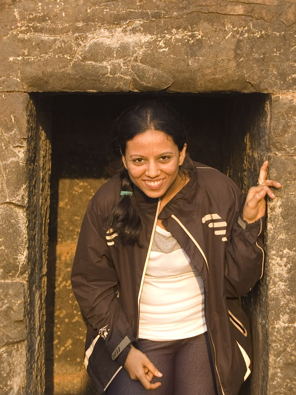
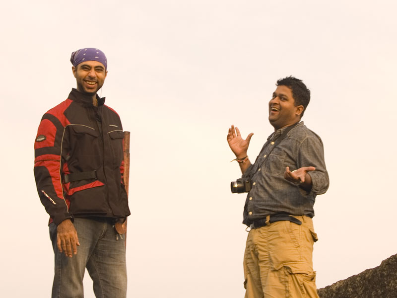
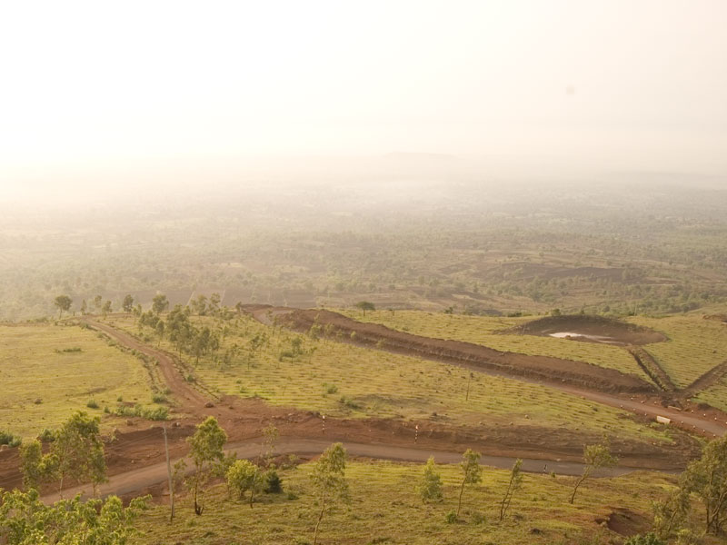
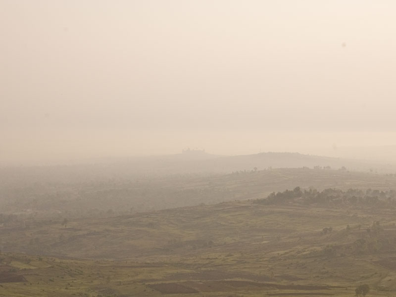
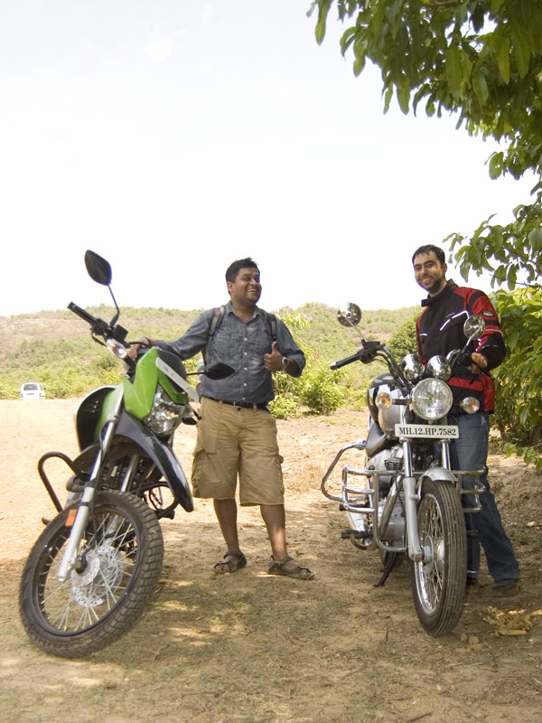

We woke up on time for a change, although we were still quite fatigued by yesterday's long ride. Anvith called at 5:15 sharp. He was at the hotel gates. We loaded up some essentials and leftover snacks from the day before, and piled up outside the gates.

<figure>
  
  <figcaption>Morning glory</figcaption>
</figure>

#### Part I – Yellurgarh and Nandgad

We followed him through empty streets of Belgaum until we were out of the city and in the countryside. It didn't take long either. While the city roads were quite manageable, the surface turned to hell in the countryside. The Impulse handled it all very well, while the Thunderbird, with its lazy geometry and loaded with the pillion, felt like an ox. We reached Yellurgarh an hour since leaving the hotel room. Thankfully, the last climb up to the fort gates was made up of excellent tarmac. Bad roads were forgiven for the experience of leaning Anna through those curves.

<figure>
  
  <figcaption>It's showtime!</figcaption>
</figure>

We parked outside the fort gates and hiked the short distance up. The light was good and there was a slight nip in the air. After walking around the rather small premises, we sat down for breakfast in the morning light. Anvith played the perfect host, fishing out coffee, bread, jam and peanut chutney from his bag. Our contribution of a solitary pack of biscuits looked insignificant in comparison.

<figure>
  
  <figcaption>The road up to Yellurgarh</figcaption>
</figure>

After breakfast we headed towards Nandgad, to see the church there. Twelve kilometres of beautifully shaded and well made road melted away in no time. Being early, traffic was sparse and we could even stop for a few photographs along the way. After crossing Nandgad village, the road turned bad again, much worse than what I had to suffer in the morning. The Thunderbird kept slipping in the loose gravel and stones. Target fixation is a bitch. My brain frequently interpreted “*Don’t* look at that rock!” as “Don’t look at *that* rock!”. And any rider can guess about what my eyes would be fixed upon. I finally gave up about two hundred metres before the bottom of the climb and parked. Anvith, eager to test out his new off-roader, took it higher up, while we followed on foot.

<figure>
  
  <figcaption>The new Vidhan Soudha building under construction in the distance</figcaption>
</figure>

The short climb to the top was only a bit difficult because we were loaded down in the heat by my heavy riding jacket and two helmets. The church itself was pretty unique, dedicated as it was to the [Way of the Cross](http://en.wikipedia.org/wiki/Stations_of_the_Cross). Interestingly, the church also maintains [their own website](http://nandgadcross.com). Climbing down was easier, though the sun still beat down mercilessly. After some dithering for photos and refreshments, we split up back again at Belgaum. We were to meet again at 4 for a ride to Belgaum Fort and lake.

#### Part II – Belgaum Fort and Lake

The rains played spoilsport again by pouring down for exactly an hour at 4. Anvith left from his place when it finally stopped and showed up 10 minutes later and we rode off through the cool evening air to Belgaum Fort.

The fort has a history stretching back to the 13th century. It's earliest construction was undertaken by a king called Jaya Raya. Over the years, it has gone through several extensions and additions under the Rashtrakutas, kings of Vijayanagar (or Hampi), Sultans of Bijapur, Marathas and finally, the British. It is currently controlled by the Belgaum Cantonment Board and houses some wings of the defence forces. It is open to the public, however, due in no small part to the presence of several temples and mosques inside the fort. Being short on time, we only managed to check out the Kamal Basadi Jain temple, dedicated to the twenty second Tirthankara, Neminath. Photography is prohibited inside the fort premises, which is a pity because this temple has some really beautiful architecture.

<figure>
  
  <figcaption>Anvith steals my thunder with his new Impulse</figcaption>
</figure>

This was followed by a short walk around the Belgaum Lake nearby. Being late in the evening, we were not able to walk around the entire circumference, which goes as much as 2-3 kilometres. The evening ended with dinner at the restaurant at our hotel, followed by some more ice cream from Aditya's. Thanks to Anvith, this leg of the trip went very, very well. While we are culture buffs, it was his incessant chatter and interesting quips that made the trip real fun. We took with us fond memories.
