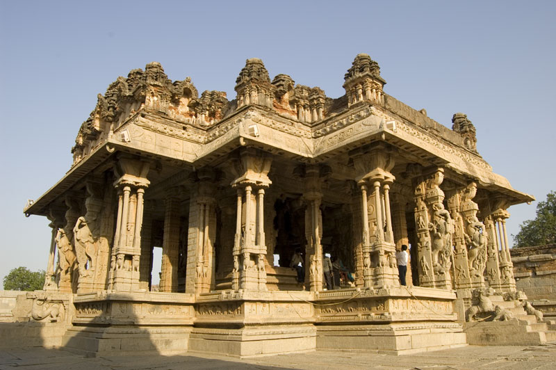
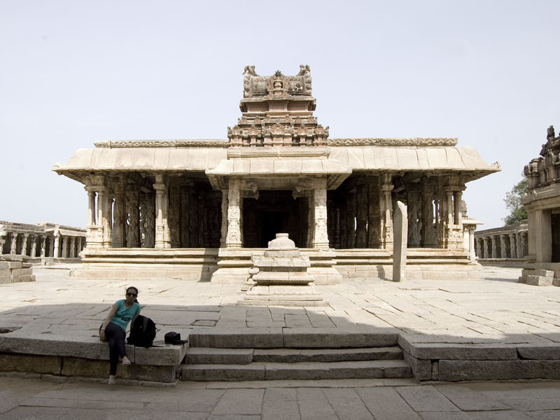
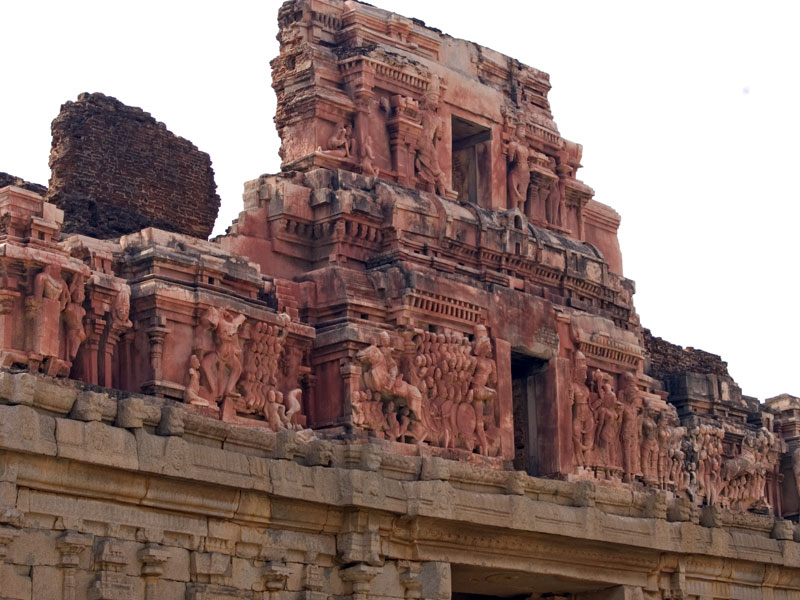
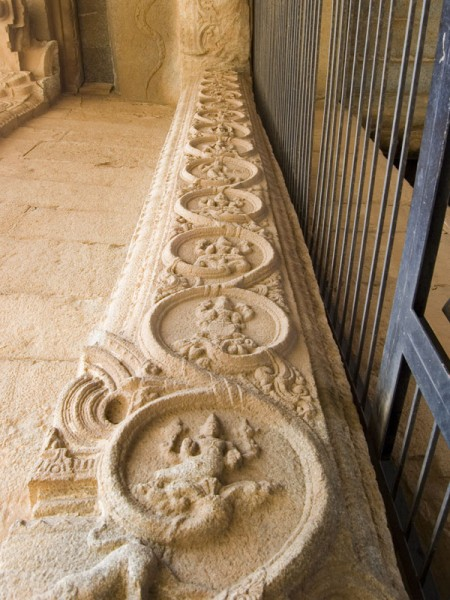
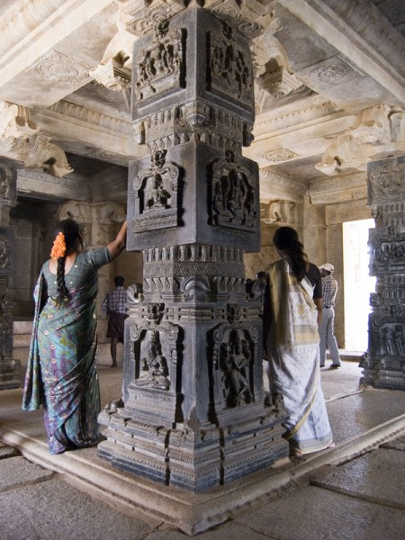
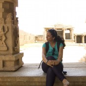
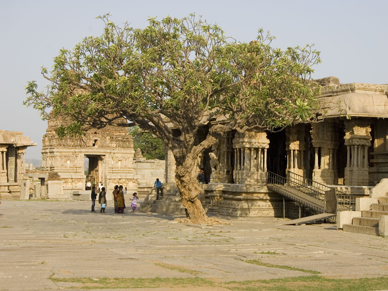
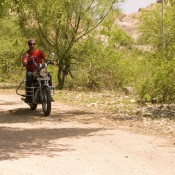
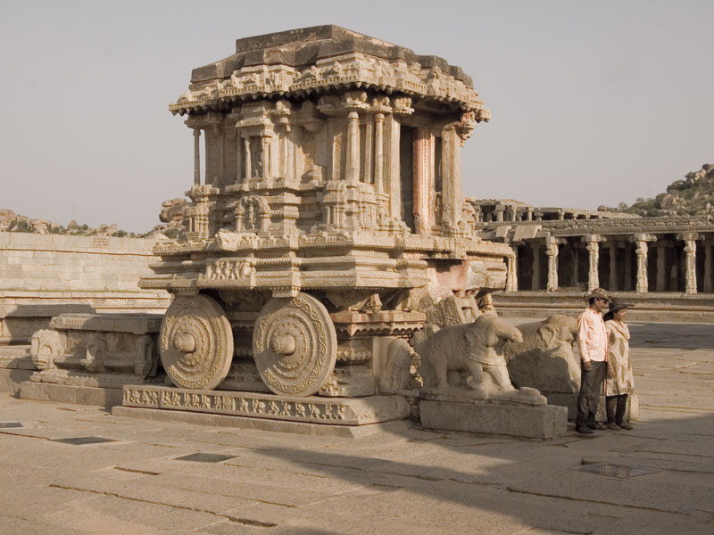

Kalyana Mantapa, or the wedding hall, at the Vittala Temple complex

Having spent the first day getting familiar with the site, I was a lot more confident now of being able to do some justice to the royal enclosure without the aid of a guide. We had to spend time waiting for Mango Tree, the restaurant from the evening before, to open up for breakfast before we could go ahead. The food there was so nice that we were now unwilling to take risks elsewhere. After pancakes and grilled sandwiches, all washed down with hot chocolate, we were ready for the day's adventures.

At the Krishna Temple

Stucco sculptures on the temple gate depict the victory of Krishnadevaraya in his campaign against the kingdom of Utkala.

Unlike at the religious centre, vehicles can be driven into the royal enclosure. In fact, this is the recommended way of exploring here, simply because of the distances between different sites. They usually lie at least 2-3 kilometres away from each other. Add up the walking required within their premises and possibly going back and forth for meals, and you're looking at an ungodly figure which causes a lot of wasted time by the end of the day. Even a bicycle is better than walking.

This circuit covers the Krishna Temple, Ugra Narsimha idol, underground Shiva Temple, Hazara Rama Temple, the zenana complex, elephant stables and several other sites. The ASI museum also falls on this same route, although we did not have time to visit.

### The Morning Session

We started off with the [Krishna Temple](http://hampi.in/krishna-temple), which takes at least an hour for a casual look around. While the complex is not all that large as such, it has several structures and some well-preserved relief sculptures which immediately catch the eye. For those with an eye for detail and the time to spare, this site itself can consume several hours.

Dasha Avatar reliefs at the temple gates

Krishnadevaraya commissioned construction in the 16th century to celebrate his victory over the kingdom of Utkala in present-day Orissa. The original idol of Balakrishna has been relocated to the state museum in Chennai. The main structure as well as accompanying shrines and pillared halls are all beautifully carved, partly due to the temples relatively recent vintage. Some things to note are the figures of Yalis on the pillars of the main structure, and the reliefs of the 10 avatars of Vishnu at the main gate.

The underground Shiva Temple, up next in the route map, was a bit of a downer due to lack of maintenance and the resultant flooding of the interiors. Architecturally too, this place is nothing particularly substantial to speak of. It is a convenient location to waste away hot afternoons due to its cooler temperatures and surrounding gardens. Bring a food basket and a mat to make a picnic out of it.

Tourists strike a pose inside the mukhmantapa at the Hazara Rama Temple

Another location great for hiding out from the sun and heat is the mosque, just a short distance away from the underground Shiva Temple. This is actually a large complex with several structures including a watch tower, a band tower and a mosque. We sat under the shade in the mosque for a while to catch some relief from the heat before moving on to the [Hazara Rama Temple](http://hampi.in/hazara-rama-temple).

This is easily one of the nicest and best-preserved sites here, on par with the Krishna Temple. This temple is popular for the carved reliefs of the Ramayana on its walls. While this site is not as large as any of the other temple complexes in Hampi, its importance is greatly elevated due to its central location in the royal enclosure. Historians believe that this temple was used as a private shrine for the king and the royal family.

At the Hazara Rama Temple

A small open-air museum and merchandise store lies at the ASI office nearby. The artifacts and idols here are worth looking at, in spite of the apparent lack of visitors. Also of note is the photo museum where you can see prints of original works by Alexandar Greenlaw and John Gollings. Greenlaw was a member of the British army with an interest in surveying and documenting the regions of the empire. He was part of the earliest efforts of the British to establish an archeological survey department in India. His photographs, lost for many years, were discovered in 1980 in a private collection. His waxed paper negatives provide an insight into the earliest records of discovery and excavation at Hampi. Replicating his photographs with modern technology is a popular activity for many visitors today.

The main hall of the Vittala Temple, reknowned for its musical pillars

We covered them up to the elephant stables before returning back to Mango Tree for lunch (yes, it was *that* good). After whiling away the worst of the afternoon under its shady interiors, we rode back to the Vittala Temple to do better justice to it in the soft evening light.

Vittala Temple is a lot more easily accessible from the royal enclosure side. You can park your vehicle at the parking lot and either walk the 2 kilometres to the temple, or take an electric car which charges Rs. 20 for a to-and-fro ticket. Walking gives you the option of stopping at Pushkarni, a stepped tank which lies close to the Vittala Temple. We chose to take the car because of the crazy heat. The weather only began to get more tolerable after 5:30 pm while we were in the temple premises.

The day ended with an early ride back to the hotel, mediocre but convenient hotel room service dinner and an early lights-out in preparation for the ride to Badami the next day.

Riding through the dusty roads between sites

#### Final Impressions

While we did visit Hampi in this trip, I cannot rightly say that we have done it justice. Two days is barely enough to get familiar with the layout. I could spend a week here before beginning to get bored. If you are a history buff, you could probably spend even more time. Adventure seekers too come here frequently to climb the unending expanses of rocky boulders and hills. And there's something for all levels of difficulty – from straight out steps cut into the rock, to flat-faced ledges that require strength and skill to scale. The third interesting activity is to ride out into the countryside and just soak in the sights. Natural surroundings and a variety of avian population can guarantee a fun ride. The nearby bear sanctuary also sounds promising, although we didn't have the time to visit.

The stone chariot, a shrine to Garuda, at the Vittala Temple

Either my expectations were set to high for the food and accommodation arrangements, or the place really does suck. While Hotel Karthik, where we were put up, had decent reviews online, the actual experience was not quite up to the mark. Especially on the food front, I found the hotel restaurant, Nalpak (promptly rechristened Nalayak by me), to be lacking in quality and variety. Their North Indian fare was boring. And who the hell wants to eat North Indian food while in Southern India? Mango Tree and its cuisine of rich, spicy and aromatic curries and South Indian thalis was evidence that there is more to this cuisine than just idlis and dosas. But most service outlets are unwilling to experiment. There's a reason that Mango Tree gets great reviews and frequently returning visitors.
