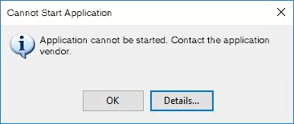

> I'm reminded of the story of the Microsoft usability test in which an error message was displayed saying, "There is a $50 bill taped to the bottom of your chair." There was. It was still there at the end of the day.
> 
> <cite><a href="https://ux.stackexchange.com/questions/393/how-do-i-get-users-to-read-error-messages#comment350_405">Joel Spolsky</a></cite>

A particular staffer in a customer's internal IT team was often focused on keeping down incident metrics at all costs. They’d sooner to wipe clean and reinstall an application to get the system back online as quickly as possible, than figure out why it suffered downtime to begin with.

But when one particularly gnarly ticket refused to go away in spite of their numerous attempts at reinstalling, they were forced to reach out to our support team for help. When the ticket eventually bubbled its way up to my desk, my first reaction was to ask for the error log. So it came as a surprise when the customer reported back that there was no log. That was impossible, because it has been our policy since forever to always log errors, and make them easy to access. It was one of those things that we got right early on.

When I remoted into the customer’s screen, this dialog was sitting there in plain sight.

<figure>
  
  <figcaption>Say what, now?</figcaption>
</figure>

I proceeded to click the Details button, which showed an in-depth description of the error along with a helpful stack trace. In the end it turned out to be something completely external to the application. I think it was a misconfigured proxy, which had to be doubled right back to the customer's own IT team to be resolved. The employee could have saved themselves a lot of time and anguish by being a bit more attentive.
