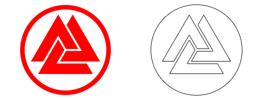
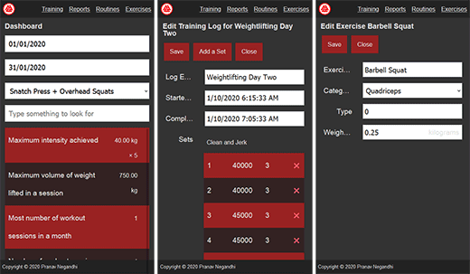

Valknut is a workout tracking application. It is designed to keep logs about any kind of weighlifting activity, such as barbell training, bodyweight training or dumbbell workouts.

The original motivation for this project was to serve as a personally tailored replacement to commercial offerings.

### History

The initial product idea germinated in the year 2016 as a means to store personal health information safely on an individual desktop computer, away from prying eyes. To that end, the application never considered the possibility of multiple simultaneous users, authentication, or non-local persistence. Each individual user would store their own records in their personal file, which would be protected by the user's own encryption key. The project was rather unimaginatively titled Fit Net.

After remaining shelved for a very long time, I picked it up again in 2020 to breathe some life back into it. Among other things, I changed it into a web application since that was a platform I knew well by then, and renamed it to a much more distinguished Valknut, invoking imagery of Norse mythology, Viking warriors and Valhalla.

<figure>
  
  <figcaption>Does a workout even count if you don't feel at the threshold of Valhalla by the time it's complete?</figcaption>
</figure>

### Project Status

The product is in what I call functionally usable state. It provides all necessary features to capture, store, retrieve, edit and delete the most essential facets of a weightlifting regimen. A basic summary report has been implemented.

The architecture of the application still aspires to be amended into a desktop-based product someday.

### Architecture

Valknut follows classical MVC architecture. The application is separated into three projects for the user interface, the querying engine and the entity model classes. The website project contains classes that implement the web controller interfaces and the views. The querying engine provides repositories, data-error abstractions and query and filtering operations. The models project is a class library to implement the entities that make up the domain model.

The following links expand upon select architectural aspects of the product.

[Domain Model](/valknut-domain-model/)

[Localisation](/valknut-localisation/)

[Validation](/valknut-validation/)

[View Models](/valknut-view-models/)

[JSON Handler](/valknut-json-serialization/)
